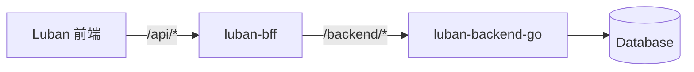

## 1. 定位与角色

- **仓库**：`luban-backend-go`，采用 Go 实现 HTTP API 服务。
- **服务对象**：
  - `luban-bff`：作为主要消费者，通过 `/backend/*` 等内部路径访问本服务。
  - 未来可选：Render 服务、其他内部系统。
- **职责**：
  - 定义并实现站点（Site）、页面（Page + PageSchema）、用户（User）、系统设置（SystemSettings）等核心领域模型。
  - 承担业务规则与数据完整性校验，处理鉴权/授权逻辑。
  - 暴露稳定、清晰的 HTTP 接口供 BFF 使用。

总体调用关系：



## 2. 领域模型设计

### 2.1 Site

站点代表一个可对外提供页面的逻辑单元。

建议字段：

| 字段       | 类型      | 说明                  |
| ---------- | --------- | --------------------- |
| id         | string    | 全局唯一 ID（UUID）   |
| name       | string    | 站点名称              |
| slug       | string    | 唯一标识（短码）      |
| baseUrl    | string    | 站点基础 URL          |
| status     | string    | 状态，如 `active` / `inactive` |
| createdAt  | datetime  | 创建时间              |
| updatedAt  | datetime  | 更新时间              |

约束建议：

- `slug` 在全局唯一。
- `baseUrl` 可选，若存在需校验为合法 URL。

### 2.2 Page 与 PageSchema

Page 表示某站点下的一条页面记录，包含元数据与 schema。

字段示例：

| 字段       | 类型      | 说明                              |
| ---------- | --------- | --------------------------------- |
| id         | string    | 页面 ID（UUID）                   |
| siteId     | string    | 所属站点 ID                       |
| name       | string    | 页面名称                          |
| path       | string    | 页面路径（如 `/home`）           |
| status     | string    | 状态，如 `draft` / `published`   |
| schema     | JSON      | 低代码页面结构（PageSchema）      |
| createdAt  | datetime  | 创建时间                          |
| updatedAt  | datetime  | 更新时间                          |

PageSchema（与前端类型保持兼容）：

```ts
interface NodeSchema {
  id: string
  type: string
  props?: Record<string, unknown>
  children?: NodeSchema[]
  eventBindings?: Record<string, string>
}

interface PageSchema {
  root: NodeSchema
  formState?: Record<string, unknown>
}
```

建议在数据库中将 `schema` 存为 JSON/JSONB 字段。

约束建议：

- `path` 在同一 `siteId` 下唯一。
- 删除站点时，对应页面处理策略可为逻辑删除或级联物理删除。

### 2.3 User

用户模型用于登录、权限控制与后台用户管理。

字段示例：

| 字段       | 类型      | 说明                                 |
| ---------- | --------- | ------------------------------------ |
| id         | string    | 用户 ID（UUID）                      |
| username   | string    | 登录账号，唯一                       |
| name       | string    | 展示名称                             |
| role       | string    | 角色，如 `admin` / `user`           |
| status     | string    | 状态：`active` / `disabled`         |
| password   | string    | 密码哈希（例如 bcrypt）             |
| createdAt  | datetime  | 创建时间                             |
| updatedAt  | datetime  | 更新时间                             |

密码存储：

- 使用安全的单向哈希（如 bcrypt），禁止明文存储。

### 2.4 SystemSettings

系统设置可采用「单行 JSON」或「KV 表」存储，覆盖基础信息与安全/通知配置。

示例结构：

```json
{
  "siteName": "Luban 管理后台",
  "logo": "https://...",
  "security": { "sessionTimeout": 30 },
  "notification": { "enabled": true }
}
```

## 3. HTTP API 设计（对 BFF 暴露）

以下接口路径以 `/backend` 作为示例前缀，实际可按部署环境调整。

### 3.1 Auth 模块

#### POST /backend/auth/login

- **请求 Body**：

```json
{ "username": "admin", "password": "123456" }
```

- **响应 200**：

```json
{
  "user": {
    "id": "user-1",
    "username": "admin",
    "name": "管理员",
    "role": "admin",
    "status": "active"
  },
  "claims": {
    "userId": "user-1",
    "role": "admin"
  }
}
```

- **说明**：
  - backend-go 可生成访问令牌（如 JWT），也可以仅返回 claims 由 BFF 签发 JWT。

#### GET /backend/auth/me

- **请求**：
  - 使用 header 中的用户信息（如 `X-User-ID`，由 BFF 注入）。
- **响应 200**：

```json
{ "id": "user-1", "username": "admin", "name": "管理员", "role": "admin", "status": "active" }
```

### 3.2 Sites 模块

#### GET /backend/sites

- **查询参数**（可选）：
  - `page`, `size`, `keyword`（可后续扩展）。
- **响应 200**：

```json
[
  {
    "id": "site-1",
    "name": "示例站点 A",
    "slug": "site-a",
    "baseUrl": "https://example-a.com",
    "status": "active",
    "createdAt": "2025-01-01T10:00:00Z",
    "updatedAt": "2025-01-10T12:00:00Z"
  }
]
```

#### GET /backend/sites/:id

- **响应 200**：单个 Site。

#### POST /backend/sites

- **请求 Body**：

```json
{ "name": "站点名称", "slug": "slug", "baseUrl": "https://...", "status": "active" }
```

- **响应 201**：创建后的 Site。

#### PUT /backend/sites/:id

- **请求 Body**：部分更新字段。
- **响应 200**：更新后的 Site。

#### DELETE /backend/sites/:id

- **行为建议**：
  - 删除站点时，对应 Page 记录可采用逻辑删除或级联物理删除。
- **响应**：200 / 204。

### 3.3 Pages 模块

#### GET /backend/sites/:siteId/pages

- **响应 200**：`PageMeta[]`（可选是否返回 schema；为减小体积，可仅返回元数据）。

#### GET /backend/sites/:siteId/pages/:pageId

- **响应 200**：

```json
{
  "id": "page-1",
  "siteId": "site-1",
  "name": "首页",
  "path": "/",
  "status": "draft",
  "schema": {
    "root": {
      "id": "root",
      "type": "LubanContainer",
      "props": {},
      "children": []
    }
  },
  "createdAt": "2025-01-01T10:00:00Z",
  "updatedAt": "2025-01-10T12:00:00Z"
}
```

#### POST /backend/sites/:siteId/pages

- **请求 Body**：

```json
{
  "name": "页面名称",
  "path": "/page-path",
  "schema": { "root": { "id": "root", "type": "LubanContainer" } }
}
```

- **响应 201**：创建后的 Page 记录。

#### PUT /backend/sites/:siteId/pages/:pageId

- **请求 Body**：允许更新 name/path/schema。
- **响应 200**：更新后的 Page。

#### DELETE /backend/sites/:siteId/pages/:pageId

- **响应**：200 / 204。

#### 约束与冲突

- 若同一站点下 `path` 冲突，应返回：
  - HTTP 409
  - JSON：`{ "code": "PAGE_PATH_CONFLICT", "message": "页面 path 已存在" }`

### 3.4 Users 模块

#### GET /backend/users

- **查询参数**：

```text
page: number
size: number
keyword: string (账号/姓名模糊搜索)
```

- **响应 200**：

```json
{
  "list": [
    {
      "id": "user-1",
      "username": "admin",
      "name": "管理员",
      "role": "admin",
      "status": "active",
      "createdAt": "2025-01-01T08:00:00Z",
      "updatedAt": "2025-01-01T08:00:00Z"
    }
  ],
  "total": 1
}
```

#### GET /backend/users/:id

- **响应 200**：单个 User。

#### POST /backend/users

- **请求 Body**：

```json
{ "username": "newuser", "password": "******", "name": "新用户", "role": "user" }
```

- **行为**：
  - 检查 `username` 唯一性（冲突时返回 409）。
  - 将 `password` 加密为哈希存储。

#### PUT /backend/users/:id

- **请求 Body**：支持更新 name/role/status，必要时支持重置密码。

#### PATCH /backend/users/:id/status

- **请求 Body**：

```json
{ "status": "active" }
```

- **行为**：变更用户状态（active/disabled）。

### 3.5 Settings 模块

#### GET /backend/settings

- **响应 200**：`SystemSettings` JSON。

#### PUT /backend/settings

- **请求 Body**：部分或完整设置 JSON，后端负责 merge 与验证。
- **示例**：

```json
{
  "siteName": "Luban 管理后台",
  "security": { "sessionTimeout": 45 },
  "notification": { "enabled": false }
}
```

## 4. 鉴权与权限模型

- backend-go 依赖 BFF 传入的用户上下文 header，例如：

```http
X-User-ID: user-1
X-User-Role: admin
```

- 典型权限规则：
  - 仅 `admin` 角色可以：
    - 管理用户（POST/PUT/PATCH /backend/users...）。
    - 修改系统设置（PUT /backend/settings）。
  - 普通 `user` 角色可访问：
    - 查看站点与页面。
    - 编辑被授权站点下的页面（如未来扩展基于站点/空间的权限）。

## 5. 错误码与响应约定

建议使用统一错误结构：

```json
{
  "code": "SITE_NOT_FOUND",
  "message": "站点不存在",
  "details": {}
}
```

常见错误码示例：

| HTTP 状态 | code                    | 场景                    |
| --------- | ----------------------- | ----------------------- |
| 400       | `INVALID_ARGUMENT`      | 请求参数非法            |
| 401       | `UNAUTHENTICATED`       | 未认证或 token 无效     |
| 403       | `PERMISSION_DENIED`     | 无权限执行操作          |
| 404       | `SITE_NOT_FOUND`        | 站点不存在              |
| 404       | `PAGE_NOT_FOUND`        | 页面不存在              |
| 404       | `USER_NOT_FOUND`        | 用户不存在              |
| 409       | `PAGE_PATH_CONFLICT`    | 页面 path 冲突          |
| 409       | `USERNAME_CONFLICT`     | 用户名已存在            |
| 500       | `INTERNAL`              | 未分类的服务器内部错误  |

## 6. 与 BFF 的边界与协作

- backend-go 不直接面向浏览器，仅服务于 BFF 和内部系统。
- JWT 签发与校验可以有两种模式：
  1. **BFF 主导**：backend-go 仅返回 claims，BFF 自行签发与验证 JWT。
  2. **后端主导**：backend-go 签发 JWT，BFF 仅做透传与简单校验。
- 本设计更推荐模式 1，以保持后端对 token 格式的解耦。

## 7. 后续实现建议

- 为核心 handler（登录、站点/页面 CRUD、用户管理、系统设置）编写单元测试与集成测试。
- 规划迁移路径：
  - 首期可用内存存储或简单 SQLite/Postgres。
  - 后续可根据需要扩展为多租户、多环境部署，并增加审计日志（记录页面 schema 变更历史）。 

