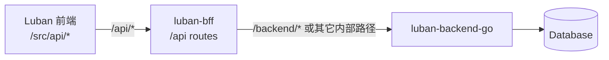
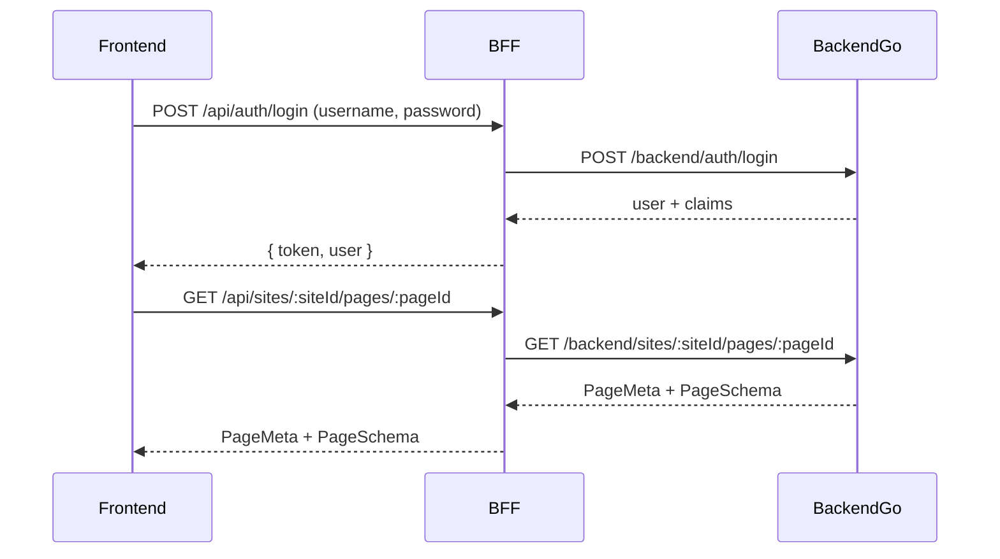

## 1. 定位与角色

- **前端仓库**：`luban`（Vue 3 + Vite 的管理后台），通过 `src/api/*.ts` 调用 HTTP 接口。
- **BFF 仓库**：`luban-bff`（建议使用 Next.js/Node），作为前端与后端之间的 **接入层 / 防腐层**：
  - 对前端 **只暴露** `/api/*` 路径。
  - 对内访问 `luban-backend-go` 提供的 HTTP 接口（下文称 backend-go）。
  - 在此层完成：认证（JWT 校验）、字段转换、多个后端聚合、错误统一化等。
- **后端仓库**：`luban-backend-go`，承载真实业务逻辑与数据持久化。

数据流总体关系：



## 2. 对外接口总览（/api/*）

前端 `luban/src/api/*.ts` 已经约定了期望的接口形状。BFF 应保证以下路径与签名稳定：

### 2.1 Auth 模块

| 方法  | 路径              | 描述         |
| ----- | ----------------- | ------------ |
| POST  | `/api/auth/login` | 用户登录     |
| GET   | `/api/auth/me`    | 获取当前用户 |

### 2.2 站点（Sites）模块

| 方法  | 路径                | 描述           |
| ----- | ------------------- | -------------- |
| GET   | `/api/sites`        | 获取站点列表   |
| GET   | `/api/sites/:id`    | 获取站点详情   |
| POST  | `/api/sites`        | 创建站点       |
| PUT   | `/api/sites/:id`    | 更新站点       |
| DELETE| `/api/sites/:id`    | 删除站点（含页面联动策略） |

### 2.3 页面（Pages）模块

| 方法  | 路径                                   | 描述         |
| ----- | -------------------------------------- | ------------ |
| GET   | `/api/sites/:siteId/pages`            | 获取某站点下的页面列表 |
| GET   | `/api/sites/:siteId/pages/:pageId`    | 获取页面详情（含 schema） |
| POST  | `/api/sites/:siteId/pages`            | 创建页面     |
| PUT   | `/api/sites/:siteId/pages/:pageId`    | 更新页面（元数据 + schema） |
| DELETE| `/api/sites/:siteId/pages/:pageId`    | 删除页面     |

### 2.4 用户（Users）模块

| 方法  | 路径                     | 描述         |
| ----- | ------------------------ | ------------ |
| GET   | `/api/users`            | 获取用户列表（含分页 & 搜索） |
| GET   | `/api/users/:id`        | 获取用户详情 |
| POST  | `/api/users`            | 创建用户     |
| PUT   | `/api/users/:id`        | 更新用户     |
| PATCH | `/api/users/:id/status` | 设置用户状态 |

### 2.5 系统设置（Settings）模块

| 方法  | 路径             | 描述         |
| ----- | ---------------- | ------------ |
| GET   | `/api/settings`  | 获取系统设置 |
| PUT   | `/api/settings`  | 更新系统设置 |

> 说明：前端 axios 封装中，`baseURL` 通常配置为 `/api`，上表为实际对外路径。

## 3. 前端契约（TypeScript 视角）

以下是源于 `luban/src/api/*.ts` 的 TS 类型摘要（伪代码，仅用于文档）：

```ts
// Auth
interface LoginPayload {
  username: string
  password: string
}

interface LoginResult {
  token: string
  user?: { id: string; username: string; name?: string }
}

// Site
interface Site {
  id: string
  name: string
  slug?: string
  baseUrl?: string
  status?: string
  createdAt?: string
  updatedAt?: string
}

// Page
interface PageSchema {
  root: NodeSchema
  formState?: Record<string, unknown>
}

interface PageMeta {
  id: string
  siteId: string
  name: string
  path: string
  status?: string
  schema?: PageSchema
  createdAt?: string
  updatedAt?: string
}

// User
interface User {
  id: string
  username: string
  name?: string
  role?: string
  status?: string
  createdAt?: string
  updatedAt?: string
}

// System settings
interface SystemSettings {
  siteName?: string
  logo?: string
  security?: { sessionTimeout?: number }
  notification?: { enabled?: boolean }
  [key: string]: unknown
}
```

这些结构是 BFF 与 backend-go 协作时的**推荐外部形状**；如内部存储不同，可在 BFF/后端做转换。

## 4. BFF 职责与调用链

### 4.1 BFF 在调用链中的位置



### 4.2 具体职责

- **统一入口**：屏蔽 backend-go 的内部路径与实现细节，对前端始终呈现 `/api/*` 接口。
- **鉴权与用户上下文**：
  - 校验来自前端的 JWT（通常在 `Authorization: Bearer <token>` 头中）。
  - 解析后将用户上下文（`userId`、`role` 等）通过 header 传给 backend-go，例如：`X-User-ID`, `X-User-Role`。
- **错误统一化**：
  - 将 backend-go 返回的错误规范化映射为统一结构：
    - 成功：`{ data: ..., error: null }` 或直接返回数据（当前前端期望为“直接数据”风格）。
    - 失败：HTTP 状态码 + JSON `{ code, message, details? }`。
- **协议适配 & 聚合**：
  - 若未来有多数据源（例如另一个服务提供用户信息），在 BFF 层组合多个 backend 调用，组装成前端所需结构。
  - 当前阶段可以简单一对一转发，为后续扩展预留空间。

## 5. 模块级接口设计（对外 /api/*）

本节从 BFF 视角，逐模块描述接口，重点说明：请求 / 响应、与 backend-go 的交互方案。

### 5.1 Auth

#### POST /api/auth/login

- **请求**（Body，与 `LoginPayload` 对齐）：

```json
{ "username": "admin", "password": "123456" }
```

- **响应 200**（与 `LoginResult` 对齐）：

```json
{
  "token": "<jwt>",
  "user": {
    "id": "user-1",
    "username": "admin",
    "name": "管理员"
  }
}
```

- **典型错误**：
  - 400：参数不合法。
  - 401：账号或密码错误。

- **内部调用**：
  - `POST /backend/auth/login`（backend-go），返回用户信息和 token/claims。
  - BFF 在此处签发 JWT（或直接透传 backend-go 生成的 JWT），并返回给前端。

#### GET /api/auth/me

- **请求**：
  - Header：`Authorization: Bearer <jwt>`
- **响应 200**：

```json
{ "id": "user-1", "username": "admin", "name": "管理员" }
```

- **内部调用**：
  - 可选方案 A：BFF 直接从 JWT 解码用户基本信息，本地返回；
  - 可选方案 B：转发到 `GET /backend/auth/me`，由 backend-go 返回最新用户信息。

### 5.2 Sites

#### GET /api/sites

- **请求**：支持后续扩展 query，如分页、关键字等（当前前端未使用，可预留）。
- **响应 200**：`Site[]`

- **内部调用**：`GET /backend/sites`

#### GET /api/sites/:id

- **响应 200**：单个 `Site`。
- **内部调用**：`GET /backend/sites/:id`

#### POST /api/sites

- **请求 Body**：`Omit<Site, 'id' | 'createdAt' | 'updatedAt'>`
- **响应 201**：新建后的 `Site`。
- **内部调用**：`POST /backend/sites`

#### PUT /api/sites/:id

- **请求 Body**：`Partial<Site>`
- **响应 200**：更新后的 `Site`。
- **内部调用**：`PUT /backend/sites/:id`

#### DELETE /api/sites/:id

- **响应 200 / 204**。
- **内部调用**：
  - `DELETE /backend/sites/:id`
  - backend-go 负责站点关联页面的级联处理（物理删除或逻辑删除）。

### 5.3 Pages

#### GET /api/sites/:siteId/pages

- **响应 200**：`PageMeta[]`
- **内部调用**：`GET /backend/sites/:siteId/pages`

#### GET /api/sites/:siteId/pages/:pageId

- **响应 200**：`PageMeta`，其中 `schema` 为完整 `PageSchema`。
- **内部调用**：`GET /backend/sites/:siteId/pages/:pageId`

#### POST /api/sites/:siteId/pages

- **请求 Body**：

```ts
{ name: string; path: string; schema?: PageSchema }
```

- **响应 201**：新建的 `PageMeta`。
- **内部调用**：`POST /backend/sites/:siteId/pages`

#### PUT /api/sites/:siteId/pages/:pageId

- **请求 Body**：

```ts
{ name?: string; path?: string; schema?: PageSchema }
```

- **响应 200**：更新后的 `PageMeta`。
- **内部调用**：`PUT /backend/sites/:siteId/pages/:pageId`

#### DELETE /api/sites/:siteId/pages/:pageId

- **响应**：200 / 204。
- **内部调用**：`DELETE /backend/sites/:siteId/pages/:pageId`

### 5.4 Users

#### GET /api/users

- **请求 query**：

```ts
{ page?: number; size?: number; keyword?: string }
```

- **响应 200**：

```json
{ "list": [/* User */], "total": 100 }
```

- **内部调用**：`GET /backend/users`，由 backend-go 支持分页、搜索。

#### GET /api/users/:id

- **响应 200**：`User`
- **内部调用**：`GET /backend/users/:id`

#### POST /api/users

- **请求 Body**：`UserCreatePayload`
- **响应 201**：新建 `User`（不包含明文密码）。
- **内部调用**：`POST /backend/users`

#### PUT /api/users/:id

- **请求 Body**：`UserUpdatePayload`（不含密码或包含新密码）。
- **内部调用**：`PUT /backend/users/:id`

#### PATCH /api/users/:id/status

- **请求 Body**：`{ status: string }`，例如 `active` / `disabled`。
- **内部调用**：`PATCH /backend/users/:id/status`

### 5.5 Settings

#### GET /api/settings

- **响应 200**：`SystemSettings`
- **内部调用**：`GET /backend/settings`

#### PUT /api/settings

- **请求 Body**：`Partial<SystemSettings>`
- **内部调用**：`PUT /backend/settings`

## 6. 鉴权与错误处理约定

### 6.1 鉴权

- 前端所有受保护路由请求需携带：

```http
Authorization: Bearer <jwt>
```

- BFF 行为：
  - 校验 JWT（签名、过期时间等）。
  - 解析用户 ID/角色，并通过 header 传递给 backend-go：

```http
X-User-ID: <user-id>
X-User-Role: <role>
```

### 6.2 错误格式

建议 BFF 返回统一错误结构（可迭代优化），示例：

```json
{
  "code": "USER_NOT_FOUND",
  "message": "用户不存在",
  "details": {}
}
```

对应 HTTP 状态码：404。

## 7. 未来扩展

- **多租户支持**：通过 `X-Tenant-ID` 头或 JWT claims 传递租户信息，在 BFF/back

## 8. Low-Code 数据源执行与版本管理契约（V1）

本节为 low-code 运行时新增的 BFF 契约，供 `luban-ui` 运行时与管理后台统一使用。

### 8.1 数据源执行网关

- **方法**：`POST /api/lowcode/datasource/execute`
- **用途**：统一执行页面 schema 中声明的数据源（REST/聚合），由 BFF 负责鉴权透传、错误统一与 trace 贯通。

请求体（推荐）：

```json
{
  "schemaId": "schema_home",
  "version": "1.2.0",
  "env": "dev",
  "dataSourceId": "getRooms",
  "payload": {
    "gender": "male"
  },
  "traceId": "trace-123"
}
```

响应 200（推荐）：

```json
{
  "traceId": "trace-123",
  "data": {
    "list": [
      { "label": "A101", "value": "A101" }
    ]
  }
}
```

错误响应：

```json
{
  "code": "DATASOURCE_EXECUTE_FAILED",
  "message": "Failed to execute datasource",
  "details": {
    "dataSourceId": "getRooms"
  },
  "traceId": "trace-123"
}
```

### 8.2 schema 版本管理接口

- **POST** `/api/lowcode/schema/draft`
  - 说明：保存草稿（可覆盖最新草稿）
- **POST** `/api/lowcode/schema/publish`
  - 说明：发布草稿为不可变版本（建议语义化版本或时间戳版本）
- **POST** `/api/lowcode/schema/rollback`
  - 说明：回滚到历史版本（推荐“复制目标版本生成新发布版本”）
- **GET** `/api/lowcode/schema/:schemaId/versions`
  - 说明：查询版本历史与状态

版本接口通用字段（建议）：

```json
{
  "schemaId": "schema_home",
  "version": "1.2.0",
  "status": "draft",
  "schema": {},
  "operator": "user-1",
  "traceId": "trace-123"
}
```

### 8.3 BFF 侧职责边界（针对本契约）

- 仅暴露统一 low-code API，屏蔽后端内部实现差异。
- 负责 JWT 解析后向后端透传 `X-User-ID`、`X-User-Role`。
- 统一返回 `{ code, message, details?, traceId? }` 错误结构。
- 保证字段命名与语义语言中立，为后续 Go 版本对齐预留空间。
