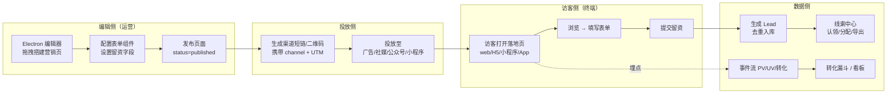

# 00 · 平台定位与现状诊断

## 一句话定位

luban 是面向市场 / 运营团队的**低代码营销页搭建 + 智能留资**一体化平台：拖拽搭建落地页 / H5 / 小程序页，多渠道投放，自动收集、去重与分发销售线索，数据驱动转化优化。

## 产品愿景

让没有研发的市场 / 运营团队，在**一小时**内独立完成「搭建营销页 → 投放 → 收线索 → 看转化」全流程，无需依赖产研排期。

## 为什么是这个定位

1. **底座已就绪**：`luban-ui` 的低代码运行时（`PageSchema` 渲染 + 可视化设计器）已发布为 npm 包（`luban-base` / `luban-low-code`），是成熟可用的技术底座。
2. **现状是「建站平台」**：现有领域为 `站点 → 页面 → 发布 → 渲染`，离「营销留资」只差一层业务领域（表单 / 线索 / 活动 / 渠道 / 事件）。
3. **演进路径已验证**：建站 → 营销留资是行业最顺的演进方向（易企秀 / 兔展 / 凡科，Unbounce / Instapage / HubSpot 营销中心均为此形态）。不需要推翻现有架构，只需在 `site/page` 之上扩展营销领域。

## 目标用户

| 角色 | 核心诉求 | 主要使用端 | 典型场景 |
|------|---------|-----------|---------|
| **市场 / 运营** | 快速搭建营销页、看转化 | Electron 编辑器、Web 后台 | 投放落地页、活动报名页、产品介绍 H5 |
| **线索运营 / 销售** | 及时拿到线索、跟进转化 | Web 后台（线索中心） | 线索认领、去重、分配、导出 |
| **平台管理员** | 管站点 / 用户 / 权限 / 物料 | Web 后台 | 多租户 / 角色 / 物料治理 |
| **访客（终端用户）** | 浏览页、留资 | Web / H5 / 小程序 / App | 看到落地页、填表留资 |
| **开发者** | 扩展物料 / 对接系统 | 各端工程 | 自定义物料、Webhook / API 对接 CRM |

## 现状诊断（基于代码事实，2026-06）

| 子项目 | 真实状态 | 成熟度 | 它实际在干什么 |
|---|---|---|---|
| `luban-ui` | 已发布 npm | ⭐⭐⭐⭐ | Vue3 低代码核心：`luban-base`(组件) + `luban-low-code`(运行时渲染器 + 设计器)。**全平台技术底座** |
| `engine/luban` | 搭建中 | ⭐⭐⭐ | Vue3 + Element Plus。管理后台：`Dashboard/Login`、`site`(列表/详情)、`page`(列表/编辑器)、`user`、`settings` |
| `website` | 搭建中 | ⭐⭐⭐ | Nuxt3 SSR。访客渲染端：按 `site.slug + path` 取 `published` 页面 schema，用 `luban-low-code` 渲染 |
| `bff` | 早期 | ⭐⭐ | Next.js16 + React19。已有 `auth/sites/users/settings` + `public/sites/:slug/pages` 路由 + JWT |
| `backend-java` | 搭建中 | ⭐⭐⭐ | Spring Boot + MyBatis + Redis + MySQL。主后端，领域=站点/页面/用户/设置 |
| `backend-go` | 搭建中 | ⭐⭐ | Java 的双实现，分层已搭好 |
| `architecture-design` | 空壳 | ⭐ | 本仓，本批文档为首次填充 |
| `ai/electron/flutter/cross-platform` | 未接入 | — | GitHub 空仓，原规划中 |

**结论**：底座（`luban-ui`）扎实，应用层（engine/bff/backend）已搭起"建站"骨架，**缺少营销留资业务领域**。本批文档将补齐顶层设计，并在 `02-roadmap` 给出分阶段落地路径。

## 核心业务闭环

四条数据流在此闭环中贯穿：
- **编辑流**：Electron → BFF → 后端（schema 持久化）
- **渲染流**：访客端 → BFF(public) → 后端（取 published schema）→ 各端渲染器
- **留资流**：访客端表单提交 → BFF → 后端（生成 Lead + 去重）
- **埋点流**：访客端事件 → BFF → 后端（Event 入库）→ 分析

## 平台定位差异

| 维度 | 通用低代码（如简道云/宜搭） | 纯建站（如凡科/Strikingly） | 纯表单（如金数据/问卷星） | **luban（本平台）** |
|------|------------------------|--------------------------|------------------------|--------------------|
| 核心产物 | 内部业务系统 | 展示型网站 | 单表单 | **营销页 + 表单 + 线索** |
| 面向 | 企业内部流程 | 品牌展示 | 数据采集 | **市场获客** |
| 低代码 | 重（流程/权限/数据模型） | 轻（页面搭建） | 极轻（字段配置） | **中（页面 + 表单搭建）** |
| 数据闭环 | 业务流程 | 访问统计 | 单次提交 | **留资 → 转化 → 归因** |

luban 的差异化在于：**低代码搭建的营销页与留资数据闭环打通**，而非孤立的建站或表单工具。
