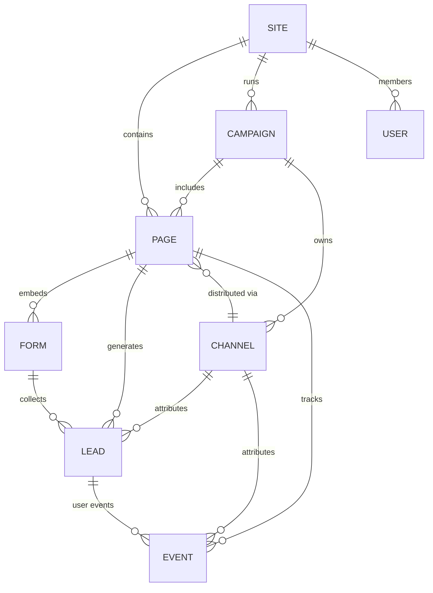
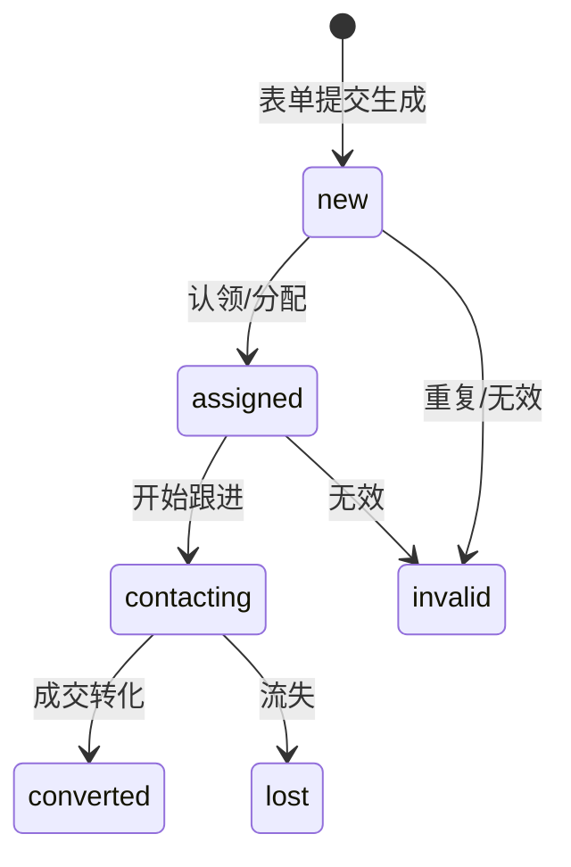

# 01 · 产品设计：领域模型与用户旅程

## 领域模型总览



## 核心实体

### Site（营销站点 / 项目）
- **定义**：一个独立的营销空间，通常对应一个品牌、一个客户或一场长期营销。承载其下的页面、活动、渠道、线索。
- **关键字段**：`id` · `slug`（短标识，用于公开 URL）· `name` · `owner_id` · `status` · `domains`（自定义域名）
- **关系**：1 → N Page / Campaign / User

### Page（营销页面）
- **定义**：一张可发布的低代码页面（落地页 / H5 / 详情页）。`schema` 是其核心内容。
- **关键字段**：`id` · `site_id` · `path`（站内路径）· `schema`（PageSchema）· `status`(draft/published/archived) · `published_at` · `version`
- **关系**：N → 1 Site；1 → N Form（页面内嵌表单）；1 → N Lead；N → 1 Channel（投放渠道，可多）

### Form（表单）
- **定义**：留资的载体。作为低代码物料嵌入页面，字段可配置。一次提交产生一条 Lead。
- **关键字段**：`id` · `site_id` · `page_id` · `name` · `field_schema`（字段定义：名称/类型/校验/必填）· `submit_config`（提交后行为：跳转/弹窗/文案）· `dedup_keys`（去重键：手机号/邮箱）· `anti_spam`（频控/验证码开关）
- **关系**：N → 1 Page；1 → N Lead

### Lead（线索）
- **定义**：访客提交表单产生的销售线索。营销平台的"现金牛"数据。
- **关键字段**：`id` · `site_id` · `form_id` · `page_id` · `channel_id` · `contact`（JSON：手机号/邮箱/姓名等）· `utm`（来源参数）· `status`(new/assigned/contacting/converted/invalid/lost) · `assignee_id`（归属人）· `dedup_hash`（去重指纹）· `created_at`
- **状态机**：


- **去重**：按 `form_id + dedup_keys` 计算 `dedup_hash`，时间窗内命中视为重复；策略可配（拒绝/覆盖/合并/标记）。手机号、邮箱为强去重键。
- **关系**：N → 1 Form/Page/Channel

### Campaign（营销活动）
- **定义**：把零散页面与渠道组织成可衡量的活动（如"618 大促"、"新品发布"）。
- **关键字段**：`id` · `site_id` · `name` · `start_at` · `end_at` · `budget` · `goal`（目标留资数）· `status`
- **关系**：1 → N Page / Channel

### Channel（渠道）
- **定义**：投放来源。同一页面可经多渠道分发，用于归因。
- **关键字段**：`id` · `site_id` · `campaign_id` · `code`（短码）· `type`(qrcode/h5/social/ad/miniapp) · `utm_template` · `short_url` · `target_page_id`
- **行为**：生成短链 / 二维码；访客经短链进入页面时，channel code + UTM 透传至前端埋点与留资。
- **关系**：N → 1 Campaign；1 → N Lead / Event

### Event（事件 / 埋点）
- **定义**：访客行为数据，转化漏斗与归因的数据源。
- **关键字段**：`id` · `site_id` · `visitor_id`（匿名 ID）· `session_id` · `page_id` · `channel_id` · `type`(pv/uv/form_view/form_submit/element_click) · `utm` · `ts`
- **关系**：N → 1 Page / Channel

### User（用户）
- **定义**：平台使用者（运营 / 销售 / 管理员）。访客匿名身份不入此表，用 `visitor_id`。
- **关键字段**：`id` · `site_id` · `name` · `email` · `role`(admin/operator/sales) · `status`
- **关系**：N → 1 Site

### Settings（系统设置）
- **定义**：站点级 / 全局配置（域名、防刷阈值、通知 Webhook、CRM 对接等）。

## 用户旅程

### 旅程 A：运营搭建并投放营销页
```
1. Electron 编辑器登录 → 选择/创建 Site
2. 新建 Page → 拖拽 luban-low-code 物料搭建
3. 放入 Form 物料 → 配置留资字段 + 去重 + 防刷
4. 预览 → 发布（status=published）
5. 在渠道中心为目标 Page 创建 Channel → 生成短链/二维码
6. 复制短链 → 投放至广告/公众号/小程序
```

### 旅程 B：访客浏览并留资
```
1. 访客点击渠道短链 → 重定向到 Page（携带 channel + UTM）
2. 渲染端（web/H5/小程序/App）按 schema 渲染页面 + 埋点 pv/uv
3. 访客填写 Form → 提交
4. 留资请求 → BFF → 后端生成 Lead（去重 + 防刷校验）
5. 提交成功 → 按 submit_config 跳转/弹窗
6. Lead 状态 = new，等待认领
```

### 旅程 C：线索运营跟进转化
```
1. 线索中心查看 new 线索（含渠道来源、UTM、留资时间）
2. 认领（assigned → 归属自己）或由规则自动分配
3. 跟进（contacting）→ 标记转化结果（converted/lost/invalid）
4. 导出线索（Excel）或经 Webhook 推送至 CRM
5. 在数据看板查看转化漏斗（按渠道/页面/活动）
```

## 能力分层（概览，详见 [02-roadmap](./02-product-roadmap.md)）

| 层级 | 主题 | 目标 |
|------|------|------|
| **P0** | 留资闭环 MVP | 平台"能留到资"：表单 + 线索 + 去重 + 防刷 |
| **P1** | 营销化 | 页面"能投出去、能衡量"：渠道 + 活动 + 埋点 + 营销物料 |
| **P2** | 增长 | 转化"更高"：A/B 测试 + 漏斗 + 线索流转 + 触达 |

## 竞品参考

| 类别 | 代表 | 借鉴点 |
|------|------|--------|
| H5 营销建站 | 易企秀 / 兔展 / MAKA | 模板市场、营销物料（倒计时/抽奖/优惠券）、多端分发 |
| 落地页 / 转化优化 | Unbounce / Instapage | A/B 测试、转化漏斗、动态文案插入 |
| 营销自动化 | HubSpot / 珍岛 T-Cloud | 线索打分、生命周期、CRM 对接 |
| 表单留资 | 金数据 / 问卷星 / 简道云 | 字段配置、去重、防刷、数据导出 |
| 低代码引擎 | 阿里 lowcode-engine / 微搭 | schema 协议、物料生态、渲染器解耦 |

**luban 的取舍**：不做大而全的营销自动化套件，聚焦**低代码页面搭建 + 留资闭环**这一核心差异化，其余（CRM/EDM/短信）通过 Webhook/API 开放对接。
