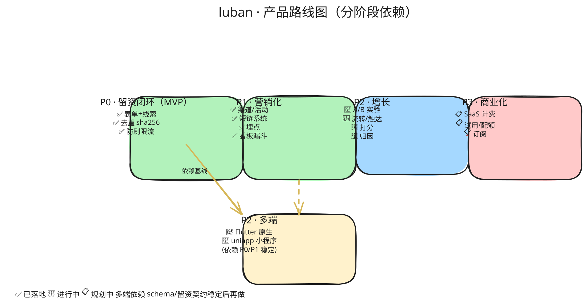

# 02 · 产品路线图

按"先让平台能留到资，再让页面能投出去、能衡量，最后让转化更高"递进。每阶段以**可验收的闭环**为完成标准，禁止"主路径收口即宣称完成"。

## P0 · 留资闭环 MVP

**目标**：运营能搭建带表单的营销页，访客能提交留资，团队能在后台看到并导出线索。

| # | 能力 | 涉及子项目 | 验收标准 |
|---|------|-----------|---------|
| 1 | `LubanForm` 物料 | luban-ui（新增 `luban-materials-marketing` 包） | 可拖拽入页；字段可视化配置（类型/必填/校验）；schema 合规 |
| 2 | 表单 schema + 提交 API | luban-ui / bff / backend-java | 提交端点生成 Lead；字段校验前后端一致 |
| 3 | Lead 领域 + 线索中心 | backend-java / bff / engine | 列表/详情/筛选/导出 Excel；状态机 new→assigned→contacting→converted/lost/invalid |
| 4 | 去重 | backend-java | 按 `form + 手机号/邮箱` 去重，命中策略可配；重复不计入有效线索 |
| 5 | 防刷 | backend-java / bff | 频控（IP/设备维度）+ 验证码（图形/短信）开关 |
| 6 | 留资通知 | backend-java / bff | 新线索 Webhook / 邮件通知运营，便于及时跟进 |

**P0 交付物**：一条可跑通的链路——编辑器搭表单页 → 发布 → 访客提交 → 后台看到线索并导出。

## P1 · 营销化

**目标**：页面能多渠道投放，且每次投放可归因、可衡量。

| # | 能力 | 涉及子项目 | 验收标准 |
|---|------|-----------|---------|
| 1 | Channel 渠道 + 短链/二维码 | backend-java / bff / engine | 生成短链与二维码；重定向携带 channel + UTM 透传 |
| 2 | Campaign 活动 | backend-java / engine | 把页面与渠道组织成活动；活动级数据汇总 |
| 3 | Event 埋点 | 各端 SDK / bff / backend-java | PV/UV/表单曝光/提交/点击事件入库；visitor 匿名 ID 贯穿 |
| 4 | 转化漏斗与看板 | engine / backend-java | 按 渠道/页面/活动 维度的留资率、转化率 |
| 5 | 营销物料 | luban-ui | 弹窗表单、倒计时、优惠券卡、拨号按钮、微信引流卡 |
| 6 | 多端渲染一致性基线 | 各端 | 同一 schema 在 web/Electron 渲染一致（Flutter/uniapp 见 P2+） |

**P1 交付物**：能投放多个渠道，并看到每个渠道带来了多少曝光与留资。

## P2 · 增长

**目标**：用数据与触达提升转化率。

| # | 能力 | 验收标准 |
|---|------|---------|
| 1 | A/B 测试 | 页面变体流量分配；按指标自动判胜 |
| 2 | 线索分配 / 流转 | 规则引擎自动分配；接 CRM（Webhook/API 双向） |
| 3 | 即时触达 | 留资后短信 / 企微 / 邮件即时通知销售 |
| 4 | 线索打分 | 按行为 + 属性计算线索质量分 |
| 5 | Flutter 原生端 | Dart 版 schema 渲染器落地（见 [04](./04-multi-client-strategy.md)） |
| 6 | uniapp 小程序端 | 小程序适配渲染器落地（见 [04](./04-multi-client-strategy.md)） |

## 阶段依赖

> 📐 源文件：`diagrams/02-roadmap.excalidraw`（手绘风，可用 [excalidraw.com](https://excalidraw.com) 拖入编辑）

多端（Flutter/uniapp）依赖 P0/P1 的 schema 与留资契约稳定后再做，避免返工。

## 关键成功指标（KPI）

| 阶段 | 北极星指标 | 辅助指标 |
|------|-----------|---------|
| P0 | 周有效留资数 | 表单完成率、去重率、防刷拦截率 |
| P1 | 渠道留资 ROI | 单渠道留资成本、渠道转化率、页面跳出率 |
| P2 | 线索成交转化率 | 线索响应时长、A/B 提升幅度、触达到达率 |

## 原则

- 每阶段结束须有**端到端可验收链路**（含 E2E），禁止骨架交付
- schema 是 SSOT：P0 的表单 schema 一旦发布，后续多端渲染器必须向后兼容
- 多端不在 P0/P1 关键路径上（编辑用 Electron/Web，访客展示用 web/H5 已够），避免被多端拖慢核心闭环
