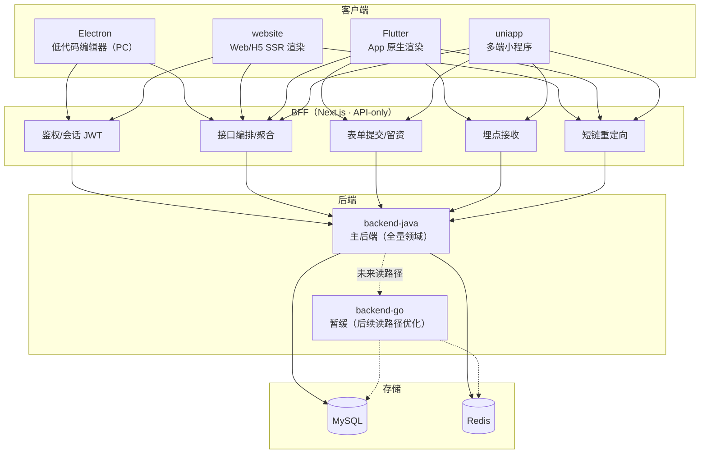

# 03 · 系统架构

## 总体架构



## 子项目职责矩阵

| 子项目 | 技术栈 | 职责 | 现状 | 阶段 |
|--------|--------|------|------|------|
| `luban-ui` | Vue3 / TS | 低代码核心：组件库 + 运行时渲染器 + 设计器 + **营销物料** | 已发布 | P0+ 扩展物料 |
| `engine` | Vue3 / Element Plus | 管理后台 + 页面编辑器（Web 版） + 线索中心 + 渠道/活动/看板 | 搭建中 | P0 起持续 |
| `website` | Nuxt3 SSR | 访客侧 Web/H5 渲染（按 site+path 取 published schema 渲染） | 搭建中 | P0 起 |
| `bff` | Next.js（API-only） | 鉴权、接口聚合、表单提交、埋点接收、短链重定向 | 早期 | P0 起 |
| `backend-java` | Spring Boot / MyBatis / Redis / MySQL | **主后端**，全量领域 + 权威 API 文档 | 搭建中 | P0 起 |
| `backend-go` | Go | 暂缓；后续高并发读路径（渲染取 schema、埋点上报）优化实现 | 搭建中（暂缓） | P2+ 视需要 |
| `electron` | Electron | 低代码编辑器桌面端（复用 luban-low-code 设计器） | 空仓 | P1+ |
| `flutter` | Flutter（**原生渲染**） | App 展示端，Dart 版 schema 渲染器 | 空仓 | P2 |
| `cross-platform` | — | 预留 | 空仓 | TBD |
| `ai-assistant` | — | AI 辅助搭建（规划） | 空仓 | P2+ |

## 数据流

平台有四条正交数据流，分别对应不同子项目组合：

### 编辑流（运营搭建页面）
```
Electron/Web 编辑器
  → bff(POST /api/sites/:id/pages) 编排
  → backend-java 持久化 Page.schema
  → Redis 缓存 published schema
```

### 渲染流（访客打开页面）
```
访客端(web/H5/Flutter/uniapp)
  → bff GET /api/public/sites/:slug/pages?path=...
  → backend-java 取 published schema（优先 Redis）
  → 返回 PageSchema
  → 各端渲染器渲染（web/uniapp 复用 luban-low-code；Flutter 用 Dart 渲染器）
```

### 留资流（访客提交表单）
```
访客端表单提交（携带 page_id / channel / utm）
  → bff POST /api/forms/:id/submit
  → backend-java：防刷校验 → 去重(dedup_hash) → 生成 Lead(status=new)
  → 异步：通知(Webhook/邮件) → 触达(P2)
```

### 埋点流（访客行为）
```
访客端 SDK 采集事件(pv/uv/click/submit)
  → bff POST /api/events（批量/高写）
  → backend-java Event 入库（P2 可由 backend-go 承接高写）
  → 离线/实时聚合 → 漏斗 / 看板
```

## 部署拓扑

| 服务 | 部署 | 对外 |
|------|------|------|
| website | SSR（Node），CDN 回源 | 公开访问（访客域名） |
| bff | Node 服务（Vercel / 自托管） | 客户端调用（私有 + public 路由） |
| backend-java | JVM 服务 | 仅 bff 可达（`/backend/*`） |
| backend-go | Go 服务 | 仅 bff 可达 |
| Electron | 客户端分发（Windows/Mac） | 运营本地 |
| Flutter | App Store / 应用市场 | 访客移动端 |
| uniapp | 各小程序平台发布 | 访客小程序 |
| MySQL / Redis | 独立实例 | 后端可达 |

网络隔离原则：**后端不直接面向客户端**，一律经 BFF。访客域名只暴露 `website` + `bff` 的 public 路由。

## 技术栈总表

| 层 | 技术 | 说明 |
|----|------|------|
| 低代码核心 | Vue3 / TypeScript | luban-ui |
| 管理后台 | Vue3 + Element Plus + Pinia | engine |
| SSR 渲染 | Nuxt3 | website |
| BFF | Next.js（App Router · route handlers） | **API-only，不做 SSR** |
| 后端（主） | Spring Boot + MyBatis + Redis + MySQL | backend-java |
| 后端（备） | Go | backend-go（暂缓） |
| 桌面编辑器 | Electron | 复用 luban-low-code 设计器 |
| 移动 App | Flutter（原生） | Dart 版 schema 渲染器 |
| 小程序 | uniapp | 多端小程序适配渲染器 |
| 包管理 | TS→pnpm · Java→Maven · Go→go mod | 统一禁 npm/yarn/Gradle |
| 编码 | UTF-8 without BOM | 硬约束 |

## 与现有架构的对齐点

- `backend-java` 已有的 `site/page/user/settings` 领域**保留**，本设计在其上**扩展** `form/lead/campaign/channel/event`，不推翻。
- `bff` 已有的 `auth/sites/users/settings` + `public/sites/:slug/pages` 路由**保留**，新增 `forms/submit`、`leads`、`events`、`channels`。
- `website` 的渲染机制（取 published schema → luban-low-code 渲染）**保留**，新增表单提交 SDK 与埋点 SDK。
- `luban-ui` 的 `luban-low-code` 运行时**保留**，新增 `luban-materials-marketing` 营销物料包 + `LubanForm` 物料。
