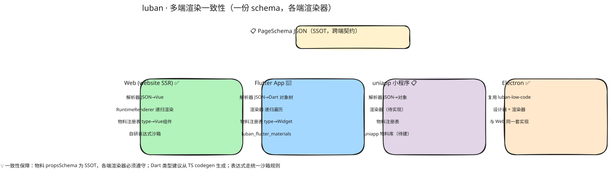

# 04 · 多端策略与 Schema 渲染一致性

> 本文档是平台最大的技术风险点。多端（Electron / Flutter 原生 / uniapp 小程序 / web）共用同一份 `PageSchema`，渲染一致性是核心挑战。

## 多端目标矩阵

| 端 | 用途 | 渲染方案 | 分叉风险 |
|----|------|---------|---------|
| **Electron** | 低代码编辑器（PC 搭建） | Chromium + `luban-low-code` 设计器 | 🟢 零（Web 基线） |
| **website** | Web / H5 访客渲染（SSR） | Chromium + `luban-low-code` 渲染器 | 🟢 零（Web 基线） |
| **Flutter** | App 访客展示 | **原生渲染，Dart 版 schema 渲染器** | 🔴 高（独立实现） |
| **uniapp** | 微信 / 支付宝 / 抖音小程序展示 | **小程序适配渲染器**（schema → uniapp 组件） | 🟡 中（运行时受限） |

## 核心原则

### 1. PageSchema 是唯一 SSOT
页面内容以一份 JSON `PageSchema` 描述，持久化在后端。各端**只消费、不私自扩展** schema 语义。任何端需要的新能力，先入 schema 协议，再各端实现。

### 2. 渲染器与物料解耦
```
PageSchema (JSON, SSOT)
   ├── TS 渲染器：luban-low-code RuntimeRenderer (Vue)  → Electron / website
   ├── Dart 渲染器：luban_flutter_renderer              → Flutter App
   └── 小程序渲染器：uniapp renderer                     → 各小程序
```
三套渲染器共享 schema 协议，各自实现"schema 节点 → 本端组件"的映射。

### 3. 样式子集从源头约束
跨端不一致的最大来源是 CSS。解决方式：**在设计器（Electron）里约束物料只能使用「跨端样式子集」**，编辑时校验，违规阻断发布。而非事后在各端打补丁。

## 各端渲染方案

### Electron — 编辑器（零分叉）
- 直接嵌入 `luban-low-code` 的设计器（拖拽 / 属性面板 / 预览）。
- 运行在 Chromium，与 website 同为 Web 基线，渲染一致性天然成立。
- 仅 PC 端，给运营桌面级编辑体验。
- **职责**：搭建页面，不负责访客展示。

### website — Web/H5 渲染（零分叉）
- Nuxt3 SSR，按 `site.slug + path` 取 published schema，用 `luban-low-code` 渲染。
- 访客侧主战场之一（PC 落地页 + 移动 H5）。

### Flutter — 原生渲染（高成本，重点设计）

> 用户决策：Flutter 走**原生渲染**（非 WebView）。这意味着需要独立的 Dart 版 schema 渲染器，是数月级工程。

#### 渲染器组成



> 📐 源文件：`diagrams/04-multi.excalidraw`（手绘风，可用 [excalidraw.com](https://excalidraw.com) 拖入编辑）

1. **Schema 模型层（Dart）**：Dart 类镜像 `PageSchema`。**建议从 TS 类型用 codegen 生成**（如 quicktype / 自建脚本），杜绝手工同步漂移。两端类型必须可追溯同一来源。
2. **解析器**：JSON → Dart schema 对象树（含版本兼容处理）。
3. **渲染器**：递归遍历节点树，按 `node.type` 查物料注册表，构建对应 Flutter Widget。
4. **物料库 `luban_flutter_materials`**：每个物料 = 一个 Flutter Widget + props 映射函数。对应 `luban-base` 的 Flutter 等价物。
5. **样式映射**：schema 中的样式描述 → Flutter 样式（见下"样式子集"）。
6. **事件系统**：物料交互事件 → Flutter callback → 调 BFF（留资 / 埋点）。

#### 样式子集（跨端契约）

浏览器 CSS 与 Flutter 布局模型差异大，必须约束。**在 `luban-low-code` 设计器内强制**物料只能用以下子集：

| 样式 | Web | Flutter | 说明 |
|------|-----|---------|------|
| flex 布局（方向/对齐/间距） | ✓ | Row/Column | 主力布局，两端对齐 |
| 绝对定位 | ✓ | Stack+Positioned | ✓ |
| padding/margin/border | ✓ | EdgeInsets / Border | ✓ |
| border-radius | ✓ | BorderRadius | ✓ |
| 文本（size/weight/color/align/line-height） | ✓ | TextStyle | ✓ |
| 颜色（hex/rgba） | ✓ | Color | ✓ |
| 阴影 box-shadow | ✓ | BoxShadow | 语义接近 |
| 线性渐变 | ✓ | LinearGradient | 需映射 |
| **clip-path** | ✗ | ✗ | 禁用 |
| **backdrop-filter** | ✗ | ✗ | 禁用 |
| **伪元素 / 复杂选择器** | ✗ | ✗ | 禁用 |
| **container queries** | ✗ | ✗ | 禁用 |
| grid | ⚠ 部分 | ⚠ 有限 | 仅简单网格，复杂场景禁用 |

> 此子集对齐 `.agents/rules/luban-multi-client-consistency.md` 与 `luban-lowcode-engine-quality.md` 的 CSS 约定。物料 schema 合规校验（`.agents/rules/luban-material-schema.md`）须包含"样式子集"检查。

### uniapp — 小程序适配渲染（中成本）

#### 方案
- schema → uniapp 组件（Vue3 语法，编译到微信 / 支付宝 / 抖音等多端小程序）。
- 渲染器：递归 + 动态组件（`<component :is>`）渲染节点树。
- 物料：uniapp 版物料库，部分可从 `luban-base` 适配复用（小程序 WXSS 子集限制需处理）。

#### 小程序运行时限制（必须处理）
| 限制 | 影响 | 对策 |
|------|------|------|
| 无 DOM | 不能用浏览器 DOM API | 物料用 uniapp 组件实现，不依赖 DOM |
| WXSS 子集 | 复杂 CSS 不支持 | 复用"样式子集"，进一步收窄 |
| rpx 单位 | 尺寸单位不同 | 设计器输出兼容 rpx |
| 主包 2MB | 包体积 | 物料按需引入、分包加载 |
| 网络域白名单 | BFF / 埋点域名必须后台配置 | 部署文档固化白名单清单 |
| 部分 Web API 缺失 | storage / 网络等差异 | 用 uniapp 统一 API 封装 |

## Schema 协议与版本治理

### 版本字段
- `PageSchema.schemaVersion`：schema 协议版本（如 `1.0`）
- 每个物料声明 semver 版本（`materialName@1.2.0`）
- 各端渲染器声明**支持的 schema 版本范围 + 物料版本**

### 兼容性规则
- schema 变更**必须向后兼容**：新增字段为可选；不删除 / 不改已有字段语义
- 物料升级走 deprecate → 新版本号，渲染器按版本路由
- 破坏性变更须升 `schemaVersion` 主版本号，并提供迁移期

### 回归测试（一致性保障）
- 维护一套**黄金 schema 用例**（golden cases），覆盖所有物料 + 样式子集 + 典型页面
- 各端渲染后产出快照（截图 / 结构 hash），CI 比对
- schema 或物料变更必须更新黄金用例，且**全端通过**方可合并
- 这是多端一致性的硬门禁（对齐 `.agents/rules/luban-multi-client-consistency.md`）

## 各端能力对齐矩阵

| 能力 | Electron | website | Flutter | uniapp |
|------|:---:|:---:|:---:|:---:|
| 页面设计器（编辑） | ✓ | ✗ | ✗ | ✗ |
| 页面渲染（展示） | ✓ | ✓ | ✓ | ✓ |
| 表单留资提交 | ✓ | ✓ | ✓ | ✓（域名白名单） |
| 埋点上报 | ✓ | ✓ | ✓ | ✓ |
| 渠道短链重定向 | ✓ | ✓ | ✓ | ✓ |
| 渲染基线 | Chromium | Chromium | Flutter | 小程序 RT |

功能集、状态机、错误处理须各端一致（不得因端差异省略功能），见 `luban-multi-client-consistency.md` 检查清单。

## 工作量与阶段建议

| 端 | 工作量 | 启动时机 | 前置条件 |
|----|--------|---------|---------|
| Electron 编辑器 | 低（复用 luban-low-code） | P1 | 设计器已就绪 |
| website | 低（已搭建） | P0 | — |
| Flutter 原生 | **高**（Dart 渲染器 + Flutter 物料库） | **P2** | P0/P1 schema 冻结稳定 |
| uniapp 小程序 | 中（适配渲染器 + 小程序物料） | P2 | P0/P1 schema 冻结稳定 |

**关键纪律**：Flutter / uniapp 必须在 P0/P1 的 schema 与物料**冻结稳定**后启动，否则渲染器会反复追着 schema 变更，成本失控。P0/P1 阶段访客展示用 website（web/H5）即可覆盖核心闭环。
