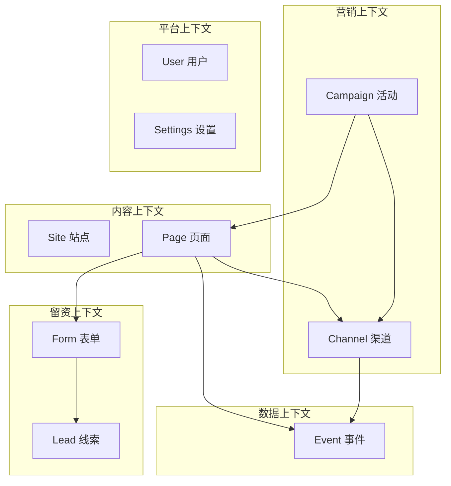

# 05 · 后端策略

## 决策：Java 先行，Go 暂缓

| | Java（主） | Go（备） |
|---|---|---|
| 状态 | **全量领域先行** | 暂缓，不强制每接口双写 |
| 职责 | 站点 / 页面 / 表单 / 线索 / 活动 / 渠道 / 事件 / 用户 / 设置 | 后续承接**高并发读路径**（渲染取 schema、埋点上报） |
| API 文档 | **权威来源**，维护在 `backend-java/docs/API.md` | 接入时按 Java 文档对齐 |

**理由**：
- 早期产品，双后端每接口双写 = 双倍开发 + 对齐成本，拖慢核心闭环（违反 P0 优先级）。
- Java 生态（MyBatis / 事务 / 定时任务 / 现有 schema.sql）更适合做全量业务领域。
- Go 优势在并发与高吞吐，留给真正有压力的读 / 写路径（渲染 schema 读取、埋点高频写）。
- `docs/DUAL_BACKEND_PARITY.md` 契约**保留**，作为 Go 接入时的对齐基准，不废弃。

### Go 何时启动（判断标准）
- 埋点写入 QPS 达到 Java 承压阈值
- 渲染取 schema 的读 QPS 显著上升
- 出现 Java 难以优化的延迟瓶颈
满足任一，启动 Go 承接该**单一职责路径**，其余仍由 Java 提供。

## 领域划分（Bounded Context）



| 上下文 | 聚合根 | 关键不变量 |
|--------|--------|-----------|
| 内容 | Site / Page | Page 必属某 Site；published 状态的 schema 不可静默变更 |
| 留资 | Form / Lead | Lead 必关联 Form/Page；dedup_hash 唯一约束 |
| 营销 | Campaign / Channel | Channel 必属某 Campaign 或 Site；short_url 唯一 |
| 数据 | Event | visitor_id + session 贯穿；channel 不可篡改 |
| 平台 | User / Settings | 角色权限边界 |

> 现有 `backend-java` 的 `site/page/user/settings` 属"内容 + 平台"上下文，**保留**；本设计**新增**"留资 + 营销 + 数据"上下文。

## 接口分层

后端按调用方分四类路由，鉴权策略不同：

| 路由前缀 | 调用方 | 鉴权 | 示例 |
|----------|--------|------|------|
| `/backend/admin/*` | BFF（已鉴权用户） | BFF 注入 `X-User-ID` / `X-User-Role` | 站点/页面/线索/活动管理 |
| `/backend/public/*` | BFF（访客渲染） | 免鉴权（仅 published 数据） | `GET /public/sites/:slug/pages?path=` |
| `/backend/lead/*` | BFF（访客留资） | 免用户鉴权 + 防刷 | `POST /lead/forms/:id/submit` |
| `/backend/event/*` | BFF（埋点） | 免用户鉴权 + 频控 | `POST /event/batch` |

**网络隔离**：后端仅 BFF 可达，不直接面向客户端（见 [03 部署拓扑](./03-system-architecture.md)）。

## 鉴权模型

```
访客/运营 → BFF（JWT 校验）
              │ 登录后 BFF 向 backend 换取 user + claims
              │ BFF 签发 JWT 给客户端
              ▼
           backend-java（信任 BFF）
              读取 BFF 注入的 Header：
              X-User-ID   用户ID
              X-User-Role 用户角色
              X-Site-ID   当前站点
```

- 后端**不直接校验客户端 token**，信任 BFF 注入的身份 Header（BFF 是唯一入口）。
- 公开路由（public / lead / event）不要求身份 Header，但有**防刷与频控**。
- 此模型与现有 `backend-java` README 一致，保留。

## 关键业务规则

### 留资去重
- `dedup_hash = hash(form_id + 去重键值)`，去重键通常为手机号 / 邮箱
- 表唯一索引：`(form_id, dedup_hash)`，配合时间窗（如 24h）
- 命中策略可配：`reject`（拒绝重复）/ `overwrite`（覆盖最新）/ `merge`（合并）/ `mark`（标记重复仍入库）
- 强去重键（手机号）跨 Form 可选站点级去重

### 防刷
- 维度：IP / 设备指纹(visitor_id) / 手机号
- 手段：滑动窗口频控 + 图形验证码 + 短信验证码（开关）
- 命中策略：拦截 + 记录 `Lead.status=invalid(reason=spam)`

### 线索状态机
见 [01-product-design · Lead 状态机](./01-product-design.md)。状态流转须服务端校验，非法转移拒绝。

### 渠道归因
- Channel 生成 short_url → 重定向时透传 `channel_code` + UTM
- 前端 SDK 将 channel/UTM 写入表单提交与埋点
- Lead / Event 携带 `channel_id`，保证归因链完整、不可篡改

## 双后端契约（Go 接入基准）

`docs/DUAL_BACKEND_PARITY.md` 继续作为 Go 实现的对齐基准：
- 同接口的**响应体 / 错误码 / 状态机**必须一致
- Java 先行定义，Go 接入时按 Java 文档对齐
- Go 启动时须通过契约校验（`scripts/contract-check.sh`，待实现）

Java 与 Go **不要求同步开发**，但 Go 上线前必须通过契约一致性验证。
