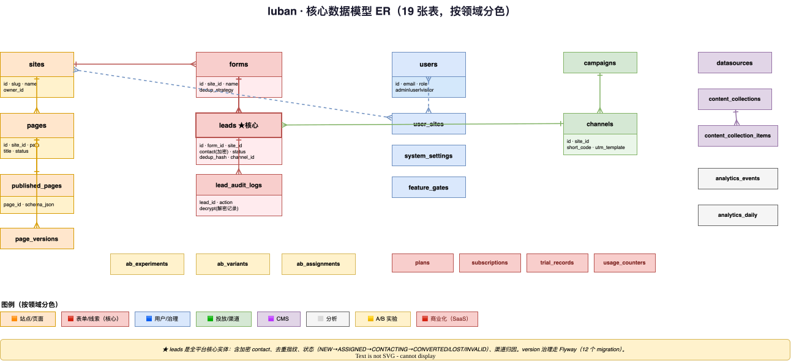

# 07 · 核心数据模型（草案）

> MySQL 8 DDL 草案，作为后端建表与契约对齐参考。ID 用 **Snowflake**（BIGINT 存储，**前端/BFF 一律字符串传输**，见 `docs/dev/snowflake-id.md`）。软删除统一 `deleted_at`。时间统一 `DATETIME`。

## ER 概览



> 📐 源文件：`diagrams/07-er-model.drawio`（可用 [draw.io](https://app.diagrams.net) 打开编辑）

## 表结构

### site（站点）
```sql
CREATE TABLE site (
  id          BIGINT       PRIMARY KEY,        -- Snowflake
  slug        VARCHAR(64)  NOT NULL,           -- 公开 URL 短标识
  name        VARCHAR(128) NOT NULL,
  owner_id    BIGINT       NOT NULL,
  status      VARCHAR(16)  NOT NULL DEFAULT 'active',
  domains     JSON,                            -- 自定义域名列表
  created_at  DATETIME     NOT NULL,
  updated_at  DATETIME     NOT NULL,
  deleted_at  DATETIME,
  UNIQUE KEY uk_slug (slug)
);
```

### page（页面）
```sql
CREATE TABLE page (
  id           BIGINT       PRIMARY KEY,
  site_id      BIGINT       NOT NULL,
  path         VARCHAR(255) NOT NULL,          -- 站内路径
  title        VARCHAR(255),
  schema       JSON         NOT NULL,          -- PageSchema（SSOT）
  status       VARCHAR(16)  NOT NULL DEFAULT 'draft',  -- draft/published/archived
  version      INT          NOT NULL DEFAULT 1,
  published_at DATETIME,
  created_at   DATETIME     NOT NULL,
  updated_at   DATETIME     NOT NULL,
  deleted_at   DATETIME,
  UNIQUE KEY uk_site_path (site_id, path),
  KEY idx_site_status (site_id, status)
);
```

### form（表单）
```sql
CREATE TABLE form (
  id            BIGINT       PRIMARY KEY,
  site_id       BIGINT       NOT NULL,
  page_id       BIGINT       NOT NULL,
  name          VARCHAR(128) NOT NULL,
  field_schema  JSON         NOT NULL,         -- 字段定义：{fields:[{name,type,required,validate}]}
  submit_config JSON         NOT NULL,         -- {action:redirect|popup, target, message}
  dedup_keys    JSON,                          -- ["phone","email"]
  dedup_window  INT          NOT NULL DEFAULT 86400,  -- 去重时间窗(秒)
  dedup_policy  VARCHAR(16)  NOT NULL DEFAULT 'reject', -- reject/overwrite/merge/mark
  anti_spam     JSON,                          -- {rateLimit, captcha, smsCaptcha}
  status        VARCHAR(16)  NOT NULL DEFAULT 'active',
  created_at    DATETIME     NOT NULL,
  updated_at    DATETIME     NOT NULL,
  deleted_at    DATETIME,
  KEY idx_page (page_id)
);
```

### lead（线索）
```sql
CREATE TABLE lead (
  id           BIGINT       PRIMARY KEY,
  site_id      BIGINT       NOT NULL,
  form_id      BIGINT       NOT NULL,
  page_id      BIGINT       NOT NULL,
  channel_id   BIGINT,                         -- 可空（直接访问）
  contact      JSON         NOT NULL,          -- {phone,email,name,...}
  utm          JSON,                            -- {source,medium,campaign,...}
  status       VARCHAR(16)  NOT NULL DEFAULT 'new',  -- new/assigned/contacting/converted/invalid/lost
  assignee_id  BIGINT,                          -- 归属人
  dedup_hash   VARCHAR(64)  NOT NULL,           -- hash(form_id+去重键值)
  source_ip    VARCHAR(64),
  visitor_id   VARCHAR(64),
  converted_at DATETIME,
  created_at   DATETIME     NOT NULL,
  updated_at   DATETIME     NOT NULL,
  UNIQUE KEY uk_form_dedup (form_id, dedup_hash),  -- 去重核心约束
  KEY idx_site_status (site_id, status),
  KEY idx_assignee (assignee_id, status),
  KEY idx_channel (channel_id),
  KEY idx_created (site_id, created_at)
);
```

### campaign（活动）
```sql
CREATE TABLE campaign (
  id         BIGINT       PRIMARY KEY,
  site_id    BIGINT       NOT NULL,
  name       VARCHAR(128) NOT NULL,
  start_at   DATETIME,
  end_at     DATETIME,
  budget     DECIMAL(12,2),
  goal       INT,                               -- 目标留资数
  status     VARCHAR(16)  NOT NULL DEFAULT 'planned',
  created_at DATETIME     NOT NULL,
  updated_at DATETIME     NOT NULL,
  deleted_at DATETIME,
  KEY idx_site (site_id, status)
);
```

### channel（渠道）
```sql
CREATE TABLE channel (
  id              BIGINT       PRIMARY KEY,
  site_id         BIGINT       NOT NULL,
  campaign_id     BIGINT,
  code            VARCHAR(32)  NOT NULL,        -- 短码
  type            VARCHAR(16)  NOT NULL,        -- qrcode/h5/social/ad/miniapp
  utm_template    JSON,                          -- {utm_source,utm_medium,...}
  short_url       VARCHAR(64)  NOT NULL,        -- 短链路径
  target_page_id  BIGINT       NOT NULL,
  status          VARCHAR(16)  NOT NULL DEFAULT 'active',
  created_at      DATETIME     NOT NULL,
  updated_at      DATETIME     NOT NULL,
  deleted_at      DATETIME,
  UNIQUE KEY uk_short_url (short_url),
  UNIQUE KEY uk_site_code (site_id, code),
  KEY idx_campaign (campaign_id),
  KEY idx_page (target_page_id)
);
```

### event（事件 / 埋点）
```sql
CREATE TABLE event (
  id          BIGINT       PRIMARY KEY,
  site_id     BIGINT       NOT NULL,
  visitor_id  VARCHAR(64)  NOT NULL,            -- 匿名访客ID
  session_id  VARCHAR(64)  NOT NULL,
  page_id     BIGINT,
  channel_id  BIGINT,
  type        VARCHAR(32)  NOT NULL,            -- pv/uv/form_view/form_submit/element_click
  utm         JSON,
  payload     JSON,                              -- 事件附加数据
  ts          DATETIME     NOT NULL,
  KEY idx_site_ts (site_id, ts),
  KEY idx_page_ts (page_id, ts),
  KEY idx_channel_ts (channel_id, ts),
  KEY idx_visitor (visitor_id)
);
-- 注：event 为高写表，P2 可迁 backend-go 承接；量大时考虑分表/列存
```

### user（用户）
```sql
CREATE TABLE user (
  id            BIGINT       PRIMARY KEY,
  site_id       BIGINT,                          -- 可空（跨站管理员）
  name          VARCHAR(64)  NOT NULL,
  email         VARCHAR(128),
  phone         VARCHAR(32),
  role          VARCHAR(16)  NOT NULL,           -- admin/operator/sales
  status        VARCHAR(16)  NOT NULL DEFAULT 'active',
  password_hash VARCHAR(255),
  created_at    DATETIME     NOT NULL,
  updated_at    DATETIME     NOT NULL,
  deleted_at    DATETIME,
  UNIQUE KEY uk_email (email),
  KEY idx_site (site_id)
);
```

### settings（系统设置）
```sql
CREATE TABLE settings (
  id    BIGINT      PRIMARY KEY,
  scope VARCHAR(16) NOT NULL,                    -- site/global
  site_id BIGINT,                                 -- scope=site 时填写
  key   VARCHAR(128) NOT NULL,
  value JSON,
  updated_at DATETIME NOT NULL,
  UNIQUE KEY uk_scope_site_key (scope, site_id, key)
);  -- 现状后端用 Redis 缓存 settings:global，DB 为持久层
```

## 关键索引说明

| 表 | 索引 | 服务场景 |
|----|------|---------|
| lead | `uk_form_dedup` | 去重唯一约束（核心） |
| lead | `idx_site_status` | 线索中心列表筛选 |
| lead | `idx_assignee` | "我的线索"查询 |
| event | `idx_site_ts` / `idx_page_ts` | 漏斗 / 看板时间范围聚合 |
| channel | `uk_short_url` | 短链重定向 O(1) 查找 |
| page | `uk_site_path` | 公开渲染按 site+path 查询 |

## 注意事项

1. **Snowflake 字符串传输**：所有 BIGINT ID 在 BFF/前端序列化为字符串，避免 JS 精度丢失（对齐 `docs/dev/snowflake-id.md`）。
2. **JSON 字段**：`schema` / `field_schema` / `contact` / `utm` 等用 MySQL JSON 类型；查询频繁的 JSON 路径可加函数索引。
3. **schema 不可变性**：`page.status=published` 后，`schema` 变更须升 `version` 并保留历史版本（建议加 `page_version` 历史表，本草案暂略）。
4. **event 体量**：埋点高写，P1 起需评估分表 / 归档策略；P2 可由 backend-go 承接写入。
5. **本草案为参考**：最终 DDL 以 `backend-java/src/main/resources/schema.sql` 为准；建表前先更新 `backend-java/docs/API.md` 再实现（对齐后端 README 约定）。
