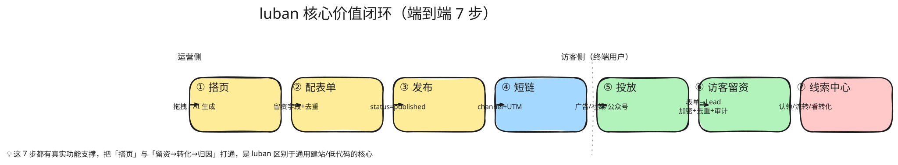

# 08 · 产品使用指南

> 面向「想用 5 分钟看懂 luban 能干什么」的读者。本文以一个完整业务闭环为主线，讲清「谁能用、怎么用、用到什么程度」，并附各角色实操路径。
> 配套文档：`00-platform-overview`（定位）、`10-ai-assistant-architecture`（AI 能力）、`09-system-architecture-impl`（技术架构）。

---

## 1. 一句话产品

**luban 是一个「低代码营销页搭建 + 智能留资」一体化平台**：市场/运营人员不写代码，一小时完成「搭页面 → 投放 → 收线索 → 看转化」全流程。

它不是通用低代码（简道云），也不是纯建站（凡科），而是把**可视化搭页**和**留资→转化→归因数据闭环**打通，专为市场获客场景设计。

---

## 2. 谁在用（四类角色）

| 角色 | 诉求 | 用什么端 | 典型动作 |
|------|------|---------|---------|
| 市场 / 运营 | 快速搭营销页、看转化 | Web 管理后台（engine）+ AI 助手 | 拖拽搭页、一句话生成页、发布、看漏斗 |
| 线索运营 / 销售 | 及时拿到线索、跟进 | Web 后台「线索中心」 | 认领、状态流转、解密联系方式、导出 |
| 平台管理员 | 管站点/用户/权限/物料 | Web 后台 | 多租户授权、用户停启用、FeatureGate 灰度 |
| 访客（终端用户） | 浏览页、留资 | 公开站点（SSR）/ H5 / App | 打开落地页、填表、提交留资 |

---

## 3. 核心闭环（端到端 7 步）

这是 luban 的价值主链，每一步都有真实功能支撑：



下面拆解每一步「怎么操作 + 背后发生了什么」。
> 📐 源文件：`diagrams/08-core-loop.excalidraw`（手绘风，可用 [excalidraw.com](https://excalidraw.com) 拖入编辑）

### 步骤 1 — 搭页面（两种模式）

**模式 A：可视化拖拽**（运营首选）
- 进入 `站点管理 → 选中站点 → 页面列表 → 新建/编辑页面`，打开**全屏设计器**。
- 左侧「组件面板」按分类（布局 / 表单 / 营销 / 导航 / 反馈 …）列出 60+ 物料。
- 拖入画布 → 右侧「属性面板」改 props（文案、颜色、样式、响应式断点、动画、CMS 绑定）。
- 支持对齐辅助线、框选、缩放平移、撤销重做、版本历史。

**模式 B：AI 一句话生成**（高效首选，见 `10-ai-assistant-architecture`）
- 设计器右侧「✨ AI 助手」抽屉，输入：`做一个用户列表页` 或 `在右侧加一个侧边栏`。
- AI 流式回传进度（理解需求→检索物料→生成结构→校验），生成后**等你确认**（HITL）才落到画布。
- AI 生成的 schema 必须过**校验闸**（结构/物料/propsSchema/表达式/循环/ID 六重校验），非法会自动回环重试，绝不把坏结构丢到画布。

### 步骤 2 — 配置留资表单
- 拖入 `LubanForm` 或 `LubanLeadCapture`，内嵌 `LubanInput` / `LubanPhoneInput` / `LubanRegionSelect` / `LubanRating` 等留资控件。
- 在属性面板绑定 `formId`（关联后端 `forms` 表），设置字段校验规则。
- 设「去重策略」（按手机号/邮箱，REJECT/MARK/OVERWRITE/MERGE）。

### 步骤 3 — 发布
- 编辑器点「发布」→ 页面 `status=published`，schema 写入 `published_pages` 表。
- 可随时「取消发布」回草稿；每次发布生成 `page_versions` 版本快照，支持回滚与版本对比。

### 步骤 4 — 生成投放短链
- 「渠道管理」创建渠道（channel），系统生成短码 → `GET /public/short/:shortCode` 解析出 `{siteSlug, pagePath, channelCode, utmTemplate}`。
- 短链支持 BFF 302 重定向（Web）和 App 直消费（链路 B）。

### 步骤 5 — 投放
- 把短链/二维码投到广告平台、社媒、公众号、小程序。

### 步骤 6 — 访客留资（公开链路）
- 访客打开 `/:site/:path` → website SSR 拉取 published schema → `RuntimeRenderer` 渲染整页。
- 访客填表提交 → `POST /api/forms/:formId/submit`（BFF 公开端点）→ 落库生成 `Lead`。
- 后端自动：**手机号/邮箱 AES-GCM 加密**存储 + **去重指纹**（sha256）+ **反垃圾限流** + **审计日志**。

### 步骤 7 — 线索中心
- 运营在「线索中心」看去重后的线索，按状态（NEW→ASSIGNED→CONTACTING→CONVERTED/LOST/INVALID）流转，状态机强制合法转移。
- 点击「查看联系方式」解密（写审计日志），支持 CSV 导出、按渠道/表单/负责人筛选。
- 「数据分析」看 PV/UV、转化漏斗、归因看板。

---

## 4. AI 助手怎么用（重点）

AI 助手是 luban 的差异化能力，三种用法：

| 用法 | 触发方式 | 效果 |
|------|---------|------|
| **整页生成** | 空画布输入需求 | AI 生成完整 PageSchema，确认后落画布 |
| **增量编辑** | 有页面时输入「把标题改红色」「加个分页」 | AI 读当前 schema 做增量修改 |
| **对话引导** | 引导面板（guidance） | 基于当前 schema 给「下一步建议」（如「表单缺提交按钮」） |

**关键体验保证**（背后是工程能力）：
- **流式反馈**：SSE/WebSocket 实时回传 agent 进度（理解→检索→生成→校验），不黑盒等待。
- **HITL 确认**：整页/覆盖/删除类操作必须人工确认才生效，AI 不会擅自改你的页面。
- **绝不编造物料**：AI 只能用 60+ 已注册物料，校验闸挡住一切幻觉。
- **隐私保护**：输入先做 PII 脱敏（手机/邮箱/身份证/银行卡）再进 LLM。
- **多模型可切**：DeepSeek（首选）/ 智谱 GLM / 通义千问，改一行配置切换，不协同。

---

## 5. 各角色实操路径速查

### 5.1 市场/运营（搭页 + AI）
```
登录 → 工作台 → 站点管理 → 选站点 → 页面列表 → 编辑
  → [拖拽搭页] 或 [AI 助手输入需求]
  → 属性面板配置 → 保存 → 发布
```

### 5.2 线索运营（线索中心）
```
登录 → 选站点 → 线索中心
  → 按状态/渠道/表单筛选 → 认领（ASSIGNED）
  → 查看联系方式（解密，记审计）→ 跟进 → 状态流转 → 导出 CSV
```

### 5.3 管理员（治理）
```
登录 → 用户管理（建用户/停启用/授权站点）
     → 系统设置 → FeatureGate 灰度开关（如 ai.generate 开关）
```

---

## 6. 能做到什么程度（现状，2026-06）

| 能力域 | 成熟度 | 说明 |
|--------|--------|------|
| 低代码搭页（拖拽+属性+响应式+动画+CMS） | ⭐⭐⭐⭐ | 60+ 物料，npm 已发布 |
| 可视化设计器（对齐/框选/缩放/版本/历史） | ⭐⭐⭐⭐ | 功能完备 |
| AI 生成/编辑/引导 | ⭐⭐⭐⭐ | LangGraph 状态图 + RAG + 校验闸 + HITL |
| 访客 SSR 渲染 + 留资闭环 | ⭐⭐⭐⭐ | 全链路打通 |
| 线索中心（去重/状态机/加密/审计/导出） | ⭐⭐⭐⭐ | 生产级安全 |
| 多租户 + RBAC | ⭐⭐⭐⭐ | 租户隔离 + admin/user/visitor 角色 |
| 渠道/短链/投放归因 | ⭐⭐⭐ | 短链解析 + UTM + 渠道维度 |
| 数据分析（PV/UV/漏斗/归因） | ⭐⭐⭐ | 事件流 + 日聚合 + 查询 |
| A/B 实验 | ⭐⭐⭐ | 实验/变体/分配/显著性 |
| 计费/订阅/试用/配额 | ⭐⭐⭐ | SaaS 商业化层 |
| 实时协同编辑（Yjs CRDT） | ⭐⭐⭐ | 多人同页编辑无冲突 |
| 多端（Electron/Flutter/App） | ⭐⭐ | Flutter 已起步，schema 驱动一致性 |

---

## 7. 不做什么（边界）

- **不做通用后台系统**（不是简道云）：聚焦营销页 + 留资，不做复杂内部业务流程。
- **不做重流程引擎**：低代码范围限定在「页面 + 表单搭建」，不做工作流/权限矩阵引擎。
- **不碰 CRM 本体**：留资数据可经 Webhook/API 导出对接外部 CRM，luban 不做 CRM。

---

## 8. 30 秒上手（Demo 脚本）

> 演示 luban 最快路径，适合向他人展示产品力。

1. **登录** engine（`http://localhost:5173`）。
2. **AI 搭页**：进任意页面编辑器 → 打开 AI 助手 → 输入 `做一个产品发布会落地页，带 Hero、特性卡片、报名表单` → 看流式生成 → 点「应用到画布」。
3. **微调**：拖拽调整布局，属性面板改文案颜色。
4. **发布** → 在 website（`http://localhost:3000/:slug/:path`）看到线上效果。
5. **留资**：在访客端填表提交 → 回 engine「线索中心」看到去重后的线索。
6. **转化**：认领 → 流转状态 → 查看联系方式（解密）。

整条链路即 luban 的核心价值闭环。
