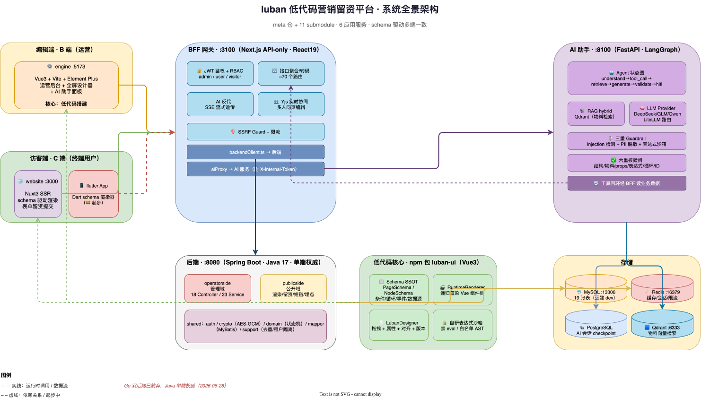
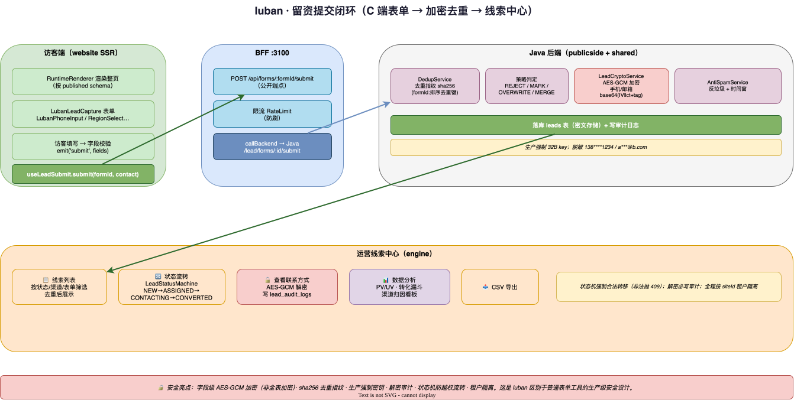

# 09 · 系统架构（实现级）

> 本文是 luban 平台的**实现级架构总览**，覆盖已落地的工程全貌：6 个应用服务、分层、数据流、安全、部署。
> 与 `03-system-architecture`（设计期蓝图）互补：那份讲「打算怎么做」，本文讲「实际怎么做成的」。
> 配套：`10-ai-assistant-architecture`（AI 子系统）、`11-lowcode-engine-impl`（低代码引擎）。

---

## 1. 平台全景

luban 是一个 **低代码营销留资平台**，由 **meta 仓（luban-workspace）+ 11 个 git submodule** 组成。核心是 schema 驱动的低代码引擎，上层是营销留资业务领域，外接 AI 助手与多端。



> 📐 源文件：`diagrams/09-platform-overview.drawio`（可用 [draw.io](https://app.diagrams.net) 打开编辑）

---

## 2. 服务清单与端口

| # | 服务 | 角色 | 端口 | 技术栈 |
|---|------|------|------|--------|
| 1 | **engine**（luban） | 运营后台 + 全屏设计器 + AI 面板 | 5173 | Vue3 + Vite + Element Plus + Pinia |
| 2 | **website**（luban-website） | 访客公开站点 SSR | 3000 | Nuxt3 SSR |
| 3 | **bff**（luban-bff） | 鉴权/聚合/AI 反代/协同 | 3100 | Next.js16 + React19 |
| 4 | **backend**（luban-backend） | 单端权威后端 | 8080（ctx `/backend`） | Spring Boot 3.2 + MyBatis + Java 17 |
| 5 | **ai-assistant**（luban-ai-assistant） | AI 生成/编辑/引导 | 8100 | FastAPI + LangGraph + LiteLLM |
| 6 | **ui**（luban-ui） | 低代码核心 npm 包 | — | Vue3，已发布 `luban-base`/`luban-low-code` |
| — | MySQL | 共享 RDBMS | 13306 | 远端 dev 服务器 |
| — | Redis | 缓存/会话/限流 | 16379 | 远端 dev 服务器 |
| — | PostgreSQL | AI 会话 checkpoint | 5432 | AI 容器组 |
| — | Qdrant | AI 物料向量检索 | 6333 | AI 容器组 |

> Go 双后端战略已放弃（2026-06-28，Q4=C），Java 为唯一后端实现。历史见 `DUAL_BACKEND_PARITY.md`。

---

## 3. 分层与子项目职责

### 3.1 meta 仓治理（luban-workspace）

```
luban-workspace/            # meta 仓（非 monorepo，git submodule 治理）
├── .agents/ .claude/       # 跨工具 AI 规则/命令/skills（统一治理）
├── docs/                   # 规范 SSOT（架构/测试/E2E/Git…）
├── scripts/                # git/coverage/github/部署编排
├── Makefile                # dev-*/test-coverage/pr-all 一键命令
└── packages/               # 11 子项目（各自独立 git 仓）
```

**治理特色**：统一 AI agent 规则（`.agents/rules/`）、任务图 SSOT（`docs/superpowers/tasks/*.json`）、Sprint MCP 敏捷看板、全栈覆盖率门禁。

### 3.2 引擎 engine（运营后台）

```
src/
├── views/        # Dashboard/Login/site/page/lead/form/user/settings
├── layouts/      # DefaultLayout（后台）/ DesignerLayout（全屏设计器）
├── router/       # 路由 + 守卫（token + admin RBAC）
├── stores/       # Pinia（user 等）
├── api/          # axios，baseURL=/api → proxy → BFF:3100
└── composables/  # useAiChat / useDesignerKeyboard
```

- 全屏设计器 `/designer/sites/:sid/pages/:pid`，复用 `luban-low-code` 的 `LubanDesigner`。
- AI 助手 `AiAssistantPanel`：消息流 + agent 进度 + HITL 确认。

### 3.3 访客端 website

- Nuxt3 SSR，路由 `/:site/:path*` → `DynamicPage`。
- 按 `site.slug + path` 经 BFF public 端点取 published schema → `RuntimeRenderer` 渲染。
- `<ClientOnly>` 包留资表单，提交走 `useLeadSubmit` → BFF `/api/forms/:id/submit`。

### 3.4 BFF（Next.js API-only）

```
src/
├── app/api/      # ~70 个 App Router 路由（见 §3.5）
└── lib/          # backendClient / authToken / aiProxy / ssrfGuard
                   # collabServer(Yjs) / collabPresence / rateLimit
```

**职责**：JWT 鉴权 + RBAC、后端聚合/转码、AI 反代（SSE 流式）、Yjs 实时协同、SSRF 防护、限流。

### 3.5 后端（Spring Boot，三层领域划分）

```
src/main/java/com/luban/backend/
├── operatorside/   # 管理域：18 个 Controller + 23 个 Service（运营/管理用）
├── publicside/     # 公开域：4 个 Controller（访客渲染/留资/短链/埋点）
└── shared/         # 共享：auth / crypto / domain / dto / entity / mapper / support / exception
```

### 3.6 AI 助手（FastAPI）

详见 `10-ai-assistant-architecture`。

### 3.7 低代码核心 luban-ui（npm 包）

详见 `11-lowcode-engine-impl`。

---

## 4. 关键数据流

### 4.1 设计器发布闭环（核心）

```
设计器拖组件 → engine 保存 schema (PUT /api/sites/:sid/pages/:pid)
  → BFF → Java PageService 落库
  → 发布 (status=published，写 published_pages + page_versions)
  → 访客访问 website /:slug/:path
  → website SSR 经 BFF public 取 published schema
  → RuntimeRenderer 渲染整页
```

### 4.2 留资提交闭环



> 📐 源文件：`diagrams/09-lead-flow.drawio`（可用 [draw.io](https://app.diagrams.net) 打开编辑）

```
访客填 LeadCapture 表单 → emit('submit', fields)
  → RuntimeRenderer @submit → provide('lubanFormSubmit')
  → useLeadSubmit.submit(formId, contact)
  → POST /api/forms/:formId/submit (BFF 公开端点)
  → callBackend /lead/forms/:id/submit (Java)
  → 落库 + 去重(sha256 指纹) + AES-GCM 加密 + 反垃圾 + 审计日志
```

### 4.3 AI 生成闭环

```
运营在 AiAssistantPanel 输入需求
  → engine → BFF /api/ai/chat (附 JWT)
  → BFF 解析身份 + 附 X-Internal-Token → AI :8100/ai/chat (SSE)
  → AI agent 状态图（understand→tool_call→retrieve→generate→validate→hitl）
  → 校验闸通过 → 发 confirm 事件（含 schema）
  → 运营确认 → applied → schema 落画布
```

### 4.4 短链解析闭环

```
渠道短链 → GET /public/short/:shortCode (Java publicside)
  → ChannelReadService.resolve → {siteSlug, pagePath, channelCode, utmTemplate}
  → BFF 302 重定向(Web) 或 App 直消费(链路 B)
```

---

## 5. 安全架构（生产级）

| 维度 | 实现 | 位置 |
|------|------|------|
| **鉴权** | BFF 签发 JWT；后端 AuthFilter 读 `X-User-ID/X-User-Role`，按路径强制 RequireUser/RequireAdmin | `bff/authToken.ts`、`backend/shared/auth/AuthFilter.java` |
| **RBAC** | admin / user / visitor 三角色；admin 全站，user 按 `user_sites` 授权，visitor 禁工具 | `TenantGuardService` |
| **多租户隔离** | 所有查询按 `siteId` 过滤；非 admin 查 `user_sites` 授权记录 | `TenantGuardService.ensureSiteAccess` |
| **留资加密** | 手机/邮箱 AES-GCM 加密（base64(IV‖ct+tag)）；生产强制 32B key | `LeadCryptoService` |
| **脱敏** | 手机 `138****1234`、邮箱 `a***@b.com` | `LeadCryptoService.mask*` |
| **去重** | sha256(formId:排序去重键) 指纹 + 策略(REJECT/MARK/OVERWRITE/MERGE) | `DedupService` |
| **反垃圾** | 限流执行器 + 时间窗 | `RateLimitExecutor` / `AntiSpamService` |
| **审计** | 解密联系方式写 `lead_audit_logs` | `LeadController.getContact` |
| **SSRF 防护** | BFF 层拦截：强制 https、禁内网/元数据 IP、DNS rebinding 防御、端口白名单 | `bff/ssrfGuard.ts` |
| **状态机** | Lead 状态合法转移强制（非法抛 409） | `LeadStatusMachine` |
| **AI 安全** | injection 检测 + PII 脱敏 + 表达式沙箱 + HITL | AI guardrails |
| **密钥治理** | 所有 key/secret 仅环境变量注入，禁入仓/日志 | 全栈约定 |

---

## 6. 后端领域模型（19 张表）

| 领域 | 表 | 说明 |
|------|-----|------|
| 站点/页面 | `sites` `pages` `published_pages` `page_versions` `user_sites` | 建站核心 + 发布版本 |
| 表单/线索 | `forms` `leads` `lead_audit_logs` | 留资闭环 |
| 用户/设置 | `users` `system_settings` `feature_gates` | 治理 + 灰度 |
| 数据源/CMS | `datasources` `content_collections` `content_collection_items` | 动态数据 |
| 分析 | `analytics_events` `analytics_daily` | PV/UV + 日聚合 |
| A/B | `ab_experiments` `ab_variants` `ab_assignments` | 实验 |
| 商业化 | `plans` `subscriptions` `trial_records` `usage_counters` | SaaS 计费 |
| 投放 | `campaigns` `channels` | 渠道/活动 |

**演进**：Flyway 版本化迁移（12 个 migration），schema.sql 兜底建表。

---

## 7. 工程质量与门禁

| 项 | 标准 |
|----|------|
| 分栈覆盖率门禁 | 各包单测/集成/E2E 分层，`make test-coverage` 统一门禁 |
| 架构守护 | ArchUnit（后端）+ dependency-cruiser（前端）自动化规则 |
| E2E | Playwright（website/engine/ui）+ Cypress（engine），禁假绿/禁降级 |
| Lint | 全栈 ESLint + Prettier + Stylelint（前端）/ ruff + mypy strict（AI）/ Checkstyle（后端） |
| Commit | commitlint conventional + husky + lint-staged |
| 测试覆盖（AI） | ≥85% 硬门禁 |

---

## 8. 部署拓扑

```
中间件（远端 dev 服务器 192.168.100.248）
  MySQL :13306 · Redis :16379（常驻）
        ↑
Java :8080（mvn spring-boot:run，Flyway 自动迁移）
        ↑
BFF :3100（next dev -p 3100）
        ↑
engine :5173（vite，proxy /api → 3100）
website :3000（nuxt，NUXT_PUBLIC_BFF_BASE_URL=3100）

AI 容器组（独立，3 容器）
  fastapi :8100 · postgres :5432 · qdrant :6333
  部署：deploy.sh SSH 推测试服务器
```

**本地 dev 原则**：全部裸进程，**禁止本机起 docker/中间件**（连接串指向远端）。AI 服务用独立容器组。

---

## 9. 多端一致性策略

luban 的「低代码」核心是 **schema 驱动**：同一份 PageSchema 在多端用各自渲染器渲染，保证业务一致。

| 端 | 渲染器 | 状态 |
|----|--------|------|
| Web（website） | `luban-low-code` RuntimeRenderer（Vue3） | ✅ 生产 |
| Web 后台（engine） | `LubanDesigner` + `RuntimeRenderer` | ✅ 生产 |
| Electron | 复用 luban-low-code 设计器 | 规划 |
| Flutter App | Dart 版 schema 渲染器（原生） | 🚧 起步 |
| 小程序 | uniapp | 规划 |

**一致性保障**：物料 propsSchema 为 SSOT，各端渲染器必须遵守；表达式走统一沙箱规则。

---

## 10. 技术决策（ADR 摘要）

仓内 `docs/adr/` 有 12 条架构决策记录，核心几条：

| ADR | 决策 | 理由 |
|-----|------|------|
| 0001 | 放弃 Go 双后端，Java 单端权威 | 维护成本 > 收益，Q4=C |
| 0002 | 前端三服务（engine/website/bff）分离 | 职责清晰 |
| 0004 | 低代码 schema 驱动 | 多端一致的根本 |
| 0005 | 任务图 JSON 为 SSOT | 进度记忆不靠对话 |
| 0008 | 禁本机 docker | 中间件远端统一 |
| 0009 | 测试分层 + 覆盖率门禁 | 全栈质量 |
| 0011 | 多端一致性 | schema 为契约 |
| 0012 | Agent 治理系统 | 规则/命令/skills 统一 |

---

## 11. 启动顺序（最小可联调 → 完整闭环）

```bash
# 最小集（运营后台基础链路）
make dev-java      # 1. Java（Flyway 建表，~30-60s）
make dev-bff       # 2. BFF（依赖 Java）
make dev-engine    # 3. engine（proxy /api → 3100）

# 完整闭环（含访客留资 SSR）
make dev-website   # 4. website（NUXT_PUBLIC_BFF_BASE_URL=3100）

# 一键全栈
make dev-apps      # 并行起 4 个核心应用

# AI 助手（独立容器组）
cd packages/ai/luban-ai-assistant && docker compose up -d --wait
```

健康检查：`make dev-check`（探测 Java/BFF/engine/website 是否 UP）。
