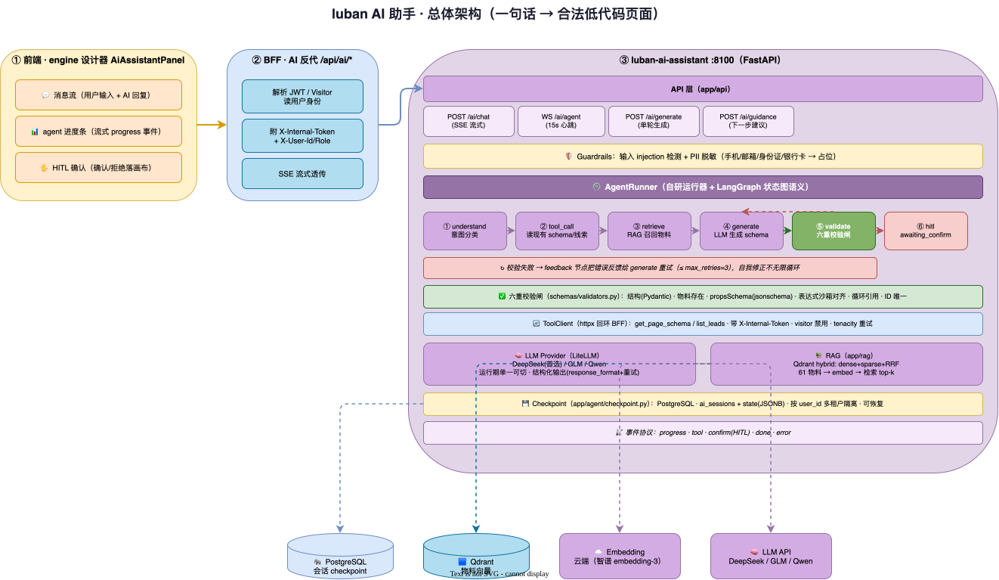
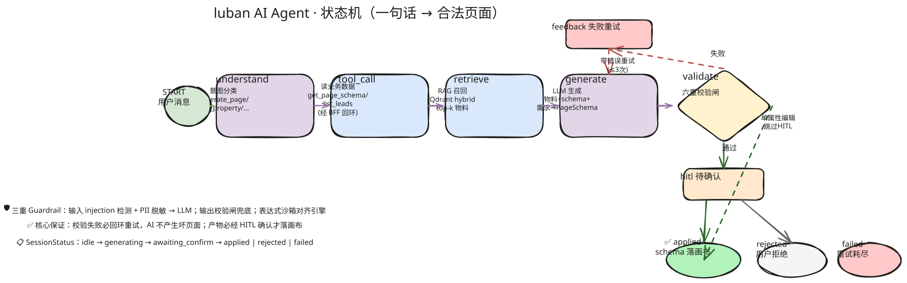
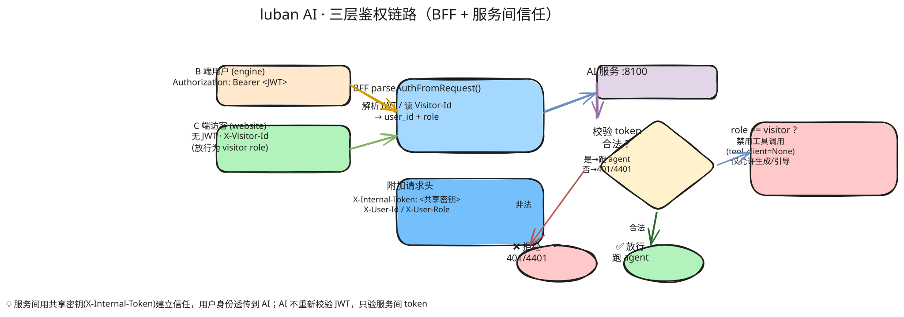

# 10 · AI 助手架构与工作流

> 本文是 luban AI 助手（`packages/ai/luban-ai-assistant`）的**实现级架构文档**。
> 目标：让读者完整理解「一句话怎么变成一个合法低代码页面」的全过程，以及背后的工程权衡。
> 配套：`08-product-usage-guide`（怎么用）、`09-system-architecture-impl`（整体技术架构）。

---

## 1. 定位与能力边界

luban AI 助手是一个**面向低代码设计器的智能副驾（copilot）**，用自然语言生成/编辑页面 schema，并给「下一步」引导。

**做什么**
- 整页生成：「做一个用户列表页」→ 完整 PageSchema。
- 增量编辑：「把标题改成红色」「加一个分页」→ 基于当前 schema 做局部修改。
- 对话引导：读当前画布状态，给结构化建议（表单缺提交按钮、表格缺分页…）。
- 查询线索：「查一下这个站点最近的线索」（工具回环读业务数据）。

**不做什么（工程边界）**
- 不绕过设计器直接改数据库——产物必须经用户 HITL 确认才落画布。
- 不编造物料——只能用已注册的 60+ 物料，校验闸兜底。
- 不执行任意代码——表达式走自研沙箱（见 `11-lowcode-engine-impl`）。

---

## 2. 技术栈与选型理由

| 层 | 选型 | 为什么 |
|----|------|--------|
| Web 框架 | **FastAPI** | 原生 async、SSE/WebSocket 一等公民、Pydantic v2 结构化校验 |
| Agent 编排 | **LangGraph**（状态图语义）+ 自研运行器 | 状态图语义清晰、可回环可中断；不绑死 LangGraph API 以便单测 |
| LLM 路由 | **LiteLLM SDK** | 一套接口路由 100+ 厂商，改前缀切模型 |
| 模型 | **DeepSeek（首选）/ 智谱 GLM / 通义千问** | 国产可控、OpenAI 兼容、运行期单一可切 |
| 结构化输出 | LiteLLM `response_format`(JSON schema) + 应用层重试 | 去掉 instructor 依赖，逼近合法 JSON |
| 向量检索 | **Qdrant**（hybrid: dense+sparse + RRF 融合） | 精简（替代 Milvus 全家桶）、hybrid 召回质量高 |
| Embedding | 云端（智谱 embedding-3），与 LLM 解耦 | 可独立配置 |
| 会话持久化 | **PostgreSQL**（ai_sessions + state JSONB） | checkpoint 支持会话恢复、多租户隔离 |
| 校验 | **Pydantic v2 + jsonschema** | 双层：结构校验 + 物料 propsSchema 合规 |
| 安全 | prompt injection 检测 + PII 脱敏 + 表达式沙箱对齐 | 输入/输出/产物三重 guardrail |

**容器规模**：3 容器（fastapi / postgres / qdrant），无 GPU。从早期 6 容器（etcd/milvus/minio/langfuse）精简而来。

---

## 3. 总体架构



> 📐 源文件：`diagrams/10-ai-overview.drawio`（可用 [draw.io](https://app.diagrams.net) 打开编辑）

**两条接入通道**（语义等价，前端按场景选）：
- `POST /ai/chat`、`POST /ai/generate` —— **SSE 流式**，适合单轮生成。
- `WS /ai/agent` —— **WebSocket**，多步交互 + 心跳（15s ping）+ 重连。

---

## 4. 核心工作流：Agent 状态图

这是 AI 助手的「心脏」。一条用户消息进来，agent 推进一个状态图到稳定态。

### 4.1 状态机



> 📐 源文件：`diagrams/10-ai-state-machine.excalidraw`（手绘风，可用 [excalidraw.com](https://excalidraw.com) 拖入编辑）

会话状态 `SessionStatus`：`idle → generating → awaiting_confirm → applied | rejected | failed`

### 4.2 节点职责（`app/agent/nodes.py`）

| 节点 | 输入 | 输出 | 失败降级 |
|------|------|------|---------|
| `understand` | 用户消息 | 意图分类 `generate_page/edit_property/query_leads/guidance` | LLM 失败→默认 `generate_page` |
| `tool_call` | 意图 + site/page | 经 httpx 回环 BFF 读现有 schema / 线索列表 | 失败→返回 None，agent 据此调整 |
| `retrieve` | 用户消息 | top-k 相关物料清单（供 generate 上下文） | RAG 故障→用内置全量物料兜底 |
| `generate` | 物料清单 + 当前 schema + 需求 | LLM 产出 PageSchema（结构化） | 失败→记 error |
| `validate` | 生成的 schema | 校验通过 / 报错原因 | — |
| `feedback` | 校验错误 | 把错误反馈给 generate 重试（≤ max_retries） | — |
| `hitl` | 校验通过的 schema | 中断等用户确认（整页/覆盖/删除）或直接 applied（单属性） | — |

### 4.3 回环与路由（`route_after_validate`）

```python
def route_after_validate(state) -> str:
    if state.status == FAILED:           return "failed"
    if state.generated_schema and not state.error:
                                          return "hitl"      # 校验通过
    return "feedback"                                            # 失败→回环重试
```

**回环保护**：校验失败最多重试 `max_retries`（默认 3）次，超限→`failed`，绝不无限循环。

### 4.4 HITL（Human-In-The-Loop）

- **整页生成 / 覆盖 / 删除** → `needs_confirm=True`，状态置 `awaiting_confirm`，流式发 `confirm` 事件，**中断等用户点确认**。
- **单属性编辑** → 跳过 HITL，直接 applied（轻量改动无需打断）。
- 用户确认/拒绝 → `resume_after_confirm` 推进到 `applied`/`rejected`。

---

## 5. 校验闸（核心工程亮点）

AI 生成物在落到画布前，必须过**六重校验**（`app/schemas/validators.py`）。这是「AI 不产生坏页面」的根本保证：

| # | 校验项 | 实现 | 失败处理 |
|---|--------|------|---------|
| 1 | **结构校验** | Pydantic v2 `PageSchema/NodeSchema` 形态 | 抛 ValidationFailedError |
| 2 | **物料存在性** | `node.type` 必须在 MaterialRegistry | 缺物料→占位不崩（可重试） |
| 3 | **propsSchema 合规** | `jsonschema.validate(props, schema)` | 不合规→抛错回环 |
| 4 | **表达式沙箱** | visible/loop.data/events 对齐引擎白名单 | 非法→抛错回环 |
| 5 | **循环引用** | children 树按对象 id 检测环 | 有环→抛错 |
| 6 | **ID 唯一性** | 缺失补 uuid；重复→报错 | 自动补齐/报错 |

**关键设计**：校验闸是 agent 回环的「裁判」。校验失败 → `feedback` 节点把错误原因反馈给 `generate` → LLM 带着错误信息重试。这让 AI 具有**自我修正能力**，而非一次出错就放弃。

---

## 6. 三重 Guardrail（安全护栏）

### 6.1 输入护栏（`app/guardrails/input.py`）

- **Prompt Injection 检测**：中英双语模式匹配（越狱指令、角色劫持、`<\|im_start\|>` 特殊 token 注入…）。
- **PII 脱敏**：手机号/邮箱/身份证/银行卡 → 占位（`[手机号]`），**脱敏后才进 LLM**。脱敏记录类型清单，不含原文。

### 6.2 输出护栏（`app/guardrails/output.py`）

- 复用校验闸做兜底，校验失败的 schema **绝不发到前端**。

### 6.3 表达式沙箱对齐（`app/schemas/expression_validator.py`）

- AI 服务侧只做**规则校验**（不执行求值），黑名单与引擎 `expression.ts` **逐字对齐**。
- 确保 AI 生成的 `visible/loop/events` 表达式在引擎侧 evaluate 时不会被沙箱拒绝。

---

## 7. LLM Provider 适配（多模型可切）

### 7.1 抽象与适配（`app/llm/provider.py` + `adapters.py`）

```python
class Provider(abc.ABC):
    def chat(self, messages, response_model) -> BaseModel:  # 结构化输出
        ...
    async def stream(self, messages) -> AsyncIterator[str]:  # 流式
        ...
```

三家厂商均走 **LiteLLM 统一接口**，仅 `provider/model` 前缀不同：

| 厂商 | LiteLLM 前缀 | 说明 |
|------|-------------|------|
| DeepSeek（首选） | `deepseek/<model>` | 原生 OpenAI 兼容 |
| 智谱 GLM | `glm/<model>` | OpenAI 兼容 |
| 通义千问 | `openai/<model>` + api_base | DashScope 兼容模式 |

### 7.2 切换机制

- **运行期单一 provider**：改 `MODEL_PROVIDER=deepseek`（一行）→ 重启加载新单例，不协同切换。
- 单例缓存（`get_provider`），测试可 `reset_provider_for_tests()` 重置。

### 7.3 结构化输出（去 instructor）

不用 instructor，改用 **LiteLLM `response_format`(JSON schema) + 应用层重试**：
- 把目标 Pydantic 模型转成 JSON schema 喂给 LLM；
- LLM 偶尔产出非法 JSON → 最多重试 2 次逼近合法；
- 重试耗尽抛错，由 agent 节点降级处理。

---

## 8. RAG 物料检索（hybrid）

### 8.1 为什么需要 RAG

LLM 不知道 luban 有哪些物料、各自 propsSchema 是什么。RAG 把**物料知识**检索出来喂给 generate 节点，让 LLM 用真实物料生成。

### 8.2 数据管道（`app/rag/sync_materials.py`）

```
luban-ui materialRegistry.getAll()
  → {name, category, description, propsSchema}
  → 抽取为 MaterialDoc（61 个内置物料）
  → embedding(dense) + 分词权重(sparse)
  → 入 Qdrant collection luban_materials（pk=name，幂等 upsert）
```

启动物料同步受 `ENABLE_STARTUP_SYNC` 控制（test/dev 默认关，生产开），失败不阻断启动（降级用内置清单）。

### 8.3 hybrid 检索（`app/rag/retriever.py`）

- **主路径**：Qdrant `query_points`（dense + sparse prefetch + 服务端 **RRF Fusion**）一步完成。
- **降级路径**：fake client / 老 API 时，分两路 search + 客户端 `_fuse`（归一化加权 0.6/0.4）。
- 融合后 top-k 物料清单传给 generate 节点作为可用物料上下文。

---

## 9. 工具回环（Agent 读业务数据，M4）

### 9.1 设计

agent 经 **httpx 回环 BFF**（非直连后端）读业务数据，享受 BFF 的双后端契约抹平与鉴权。

```
agent → ToolClient(httpx) → BFF /api/... → 后端
```

### 9.2 工具清单

| 工具 | 用途 | 触发 |
|------|------|------|
| `get_page_schema(site,page)` | 读当前页面 schema（供增量编辑参考现有结构） | generate_page/edit_property |
| `list_leads(site)` | 查线索列表 | query_leads |

### 9.3 身份与权限

- 回环时带 `X-AI-Service` + `X-Internal-Token`（服务间信任）+ `X-User-Id/X-User-Role`（用户身份透传）。
- **visitor 角色禁工具调用**（`tool_client=None`），API 端点层 + 节点层双重拦截。
- 失败 tenacity 重试（≤3 次，指数退避），超限降级返回 None/空。

---

## 10. 鉴权链路（三层信任）



> 📐 源文件：`diagrams/10-auth.excalidraw`（手绘风，可用 [excalidraw.com](https://excalidraw.com) 拖入编辑）

- **B 端用户**：Authorization Bearer JWT → BFF 解析。
- **C 端访客**：无 JWT，带 `X-Visitor-Id` → BFF 放行为 `visitor` role（P0-4 修复死锁）。
- **BFF → AI**：附加 `X-Internal-Token`（共享密钥）+ 用户身份头。
- **AI 自验**：`_auth_ws` / `get_bff_user` 校验 internal_token，失败关闭 WS（4401）/抛 401。

---

## 11. 会话持久化与多租户（Checkpoint）

### 11.1 两层存储（`app/agent/checkpoint.py`）

- `ai_sessions`：会话元数据（id/user_id/site_id/page_id/status/时间戳）。
- `ai_session_states`：完整 `AgentState` JSON（JSONB），幂等 upsert。

### 11.2 多租户隔离（MUST）

所有 `load/delete/list_sessions` 操作**按 user_id 隔离**：A 用户不可见 B 的会话。SQL 层 `WHERE user_id = $2` 强制。

### 11.3 抽象与实现

- `CheckpointStore`（抽象）/ `InMemoryCheckpointStore`（dev/test）/ `PostgresCheckpointStore`（生产，asyncpg 连接池）。
- agent 不直接依赖 LangGraph 的 graph 级 checkpoint，这里存的是**业务会话状态**，便于恢复与审计。

---

## 12. 流式通信（SSE / WebSocket）

### 12.1 事件协议

| 事件类型 | 含义 |
|---------|------|
| `progress` | agent 进度（理解/检索/生成中…） |
| `tool` | 节点执行结果 |
| `confirm` | HITL 待确认（含生成 schema） |
| `done` | 终态 applied/rejected |
| `error` | 失败 |

### 12.2 SSE 实现（`app/api/chat.py`）

`asyncio.create_task(runner.run)` 跑 agent，主协程轮询 `state.progress` 增量 yield 出去（20ms 间隔），终态发 `confirm/done/error`。

### 12.3 WebSocket（`app/api/ws.py`）

双向消息（message/confirm/pong），15s 心跳 ping，鉴权经 query param（WS 不便用 Header）。

---

## 13. 配置与部署

### 13.1 配置面（`.env`，敏感字段禁入仓）

- 应用：`ENVIRONMENT/LOG_LEVEL/CORS_ORIGINS`
- FeatureGate：`AI_GENERATE_ENABLED/AI_GUIDANCE_ENABLED`（关 `/ai/generate` 返 503）
- 模型：`MODEL_PROVIDER`（一行切三家）+ 各家 key/base_url/model
- 服务间：`AI_SERVICE_TOKEN`（BFF 共享密钥）、`BFF_BASE_URL`（工具回环目标）
- 存储：`POSTGRES_DSN` / `QDRANT_HOST/PORT`
- Embedding：`EMBEDDING_PROVIDER/API_KEY/MODEL`

### 13.2 容器（3 容器，`docker-compose.yml`）

```yaml
fastapi:   # AI 服务本体
postgres:  # 会话 checkpoint
qdrant:    # 物料向量库
```

### 13.3 部署（`deploy/deploy.sh`）

SSH 推到测试服务器，凭证从仓库根 `.env.dev` 经 `source` 注入，**禁硬编码、禁入日志**。CI 走 GitHub Secrets。

---

## 14. 工程质量

| 项 | 实现 |
|----|------|
| 测试 | 13 个测试文件，覆盖率门禁 **≥85%**（`fail_under=85`） |
| 类型 | mypy strict + Pydantic 插件 |
| Lint | ruff（E/F/I/UP/B/SIM/RUF） |
| 真实模型冒烟 | `@pytest.mark.smoke`（需 key，默认不在 CI 跑） |
| 错误体 | 统一 `{code, message, details?}`，对齐 luban 风格 |
| 可观测 | Tracer 抽象 + NoopTracer（Langfuse 已移除，预留 OTel 接入） |

---

## 15. 关键设计权衡（Why）

| 决策 | 选择 | 理由 |
|------|------|------|
| Agent 编排 | 自研运行器 + LangGraph 语义 | 不绑死 LangGraph API，单测与版本无关；回环由显式循环驱动 |
| 结构化输出 | 去 instructor，用 response_format + 重试 | 减少依赖，逼近合法即可 |
| 向量库 | Qdrant 替代 Milvus | 3 容器 vs 6 容器，hybrid 质量不降 |
| 校验闸 | 六重 + 回环 | AI 自我修正，不产生坏页面 |
| HITL | 整页确认、单属性跳过 | 平衡安全与流畅 |
| 多模型 | 运行期单一、改配置切换 | 简单可控，避免协同复杂度 |
| 工具回环 | 经 BFF 不直连后端 | 享受契约抹平与鉴权，不绕过治理 |

---

## 16. 演进路线（M0–M6 已落地）

| 里程碑 | 内容 |
|--------|------|
| M0 | 选型定型：DeepSeek 首选、Qdrant、去 Langfuse |
| M1 | LiteLLM 接管，去 instructor |
| M2 | Milvus → Qdrant hybrid 检索 |
| M3 | BFF 服务间信任（internal_token），JWT 降级可选 |
| M4 | 工具回环（agent 读业务数据） |
| M5 | BFF AI 反代（SSE 流式透传） |
| M6 | engine AiAssistantPanel（消息流/进度/HITL） |

后续：增量 patch 编辑（单节点 patch）、更细粒度工具集、OTel 可观测接入。
