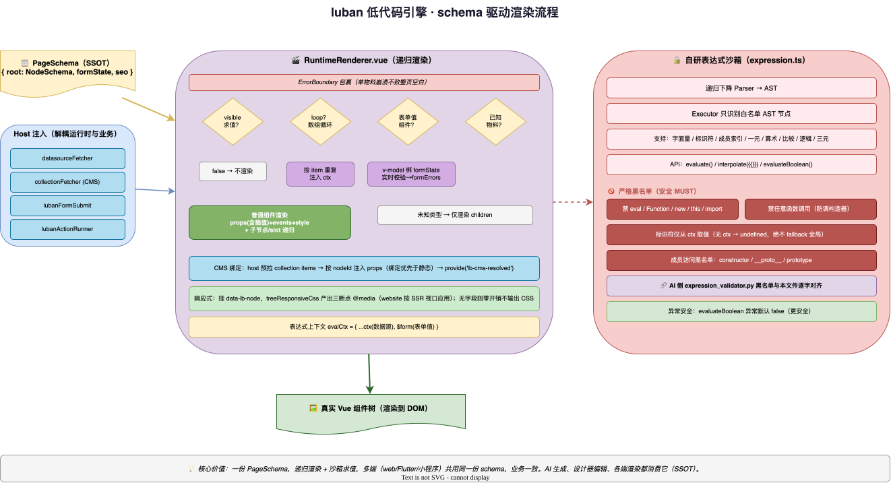

# 11 · 低代码引擎实现

> 本文是 luban 低代码引擎（`luban-ui`，npm 包 `luban-base` / `luban-low-code`）的**实现级文档**。
> 这是整个平台的「技术底座」，已发布为独立 npm 包。重点讲：schema 驱动渲染、物料契约、自研表达式沙箱、设计器架构。
> 配套：`09-system-architecture-impl`（整体架构）、`10-ai-assistant-architecture`（AI 如何生成 schema）。

---

## 1. 引擎定位

luban 低代码引擎是平台的**核心资产**，提供三件事：

1. **统一 schema**（PageSchema/NodeSchema）——页面结构的单一事实来源，多端共用。
2. **运行时渲染器**（RuntimeRenderer）——把 schema 渲染成真实 Vue 组件树，支持条件/循环/事件/数据源/CMS 绑定。
3. **可视化设计器**（LubanDesigner）——拖拽搭建、属性编辑、对齐辅助、版本历史。

**关键约束**：引擎可用性 > 各端一致性 > 后端功能（系统优先级）。

---

## 2. 包结构

```
luban-ui/  (Nx monorepo)
├── packages/
│   ├── luban-base/        # 基础 UI 组件库（LubanButton/LubanInput…）→ @luban-low-code/luban-base
│   ├── luban-low-code/    # 低代码运行时 + 设计器 → @luban-low-code/luban-low-code
│   └── luban-utils/       # 工具函数
├── apps/luban-ui/         # 组件展示/文档站
└── apps/luban-ui-e2e/     # E2E 测试
```

---

## 3. Schema 模型（SSOT）

`luban-low-code/src/lib/schema.ts` 是全平台页面结构的**单一真相源**。AI 生成、设计器编辑、各端渲染都消费它。

### 3.1 核心结构

```typescript
interface PageSchema {
  root: NodeSchema;                    // 根节点（type 通常为 LubanPage）
  formState?: Record<string, unknown>; // 表单字段值
  seo?: PageSeo;                       // SEO 元信息（SSR 注入）
}

interface NodeSchema {
  id: string;
  type: string;                        // 物料名（如 'LubanButton'）
  props?: Record<string, unknown>;     // 物料属性（符合 propsSchema）
  children?: NodeSchema[];             // 子节点树
  visible?: string | boolean;          // 条件渲染（表达式或布尔）
  loop?: NodeLoop;                     // 循环渲染
  events?: Record<string, string>;     // 事件绑定（事件名→动作表达式）
  datasource?: NodeDatasource;         // 数据源绑定
  style?: Record<string, string>;      // 节点级 CSS
  className?: string;
  responsive?: NodeResponsive;         // 响应式断点样式
  animation?: NodeAnimation;           // 动画
  cmsBinding?: NodeCmsBinding;         // CMS 内容绑定
  locked?: boolean;                    // 编辑态锁定
  hidden?: boolean;                    // 编辑态隐藏
}
```

### 3.2 能力维度

一个节点除了渲染，还能表达：

| 能力 | 字段 | 语义 |
|------|------|------|
| 条件渲染 | `visible` | 表达式求值为 false 则不渲染 |
| 循环渲染 | `loop` | `loop.data` 求值为数组，按元素多次渲染 |
| 事件 | `events` | 事件名→动作表达式（如 `navigate('/x')`） |
| 数据源 | `datasource` | 运行时拉取数据以 `varName` 注入上下文 |
| 响应式 | `responsive` | tablet/mobile 断点覆盖 desktop 样式 |
| 动画 | `animation` | 入场/hover/scroll 触发的过渡 |
| CMS | `cmsBinding` | 绑定 collection 字段，host 拉取注入 |
| SEO | `seo` | 页面级 meta（SSR） |

---

## 4. 物料契约（MaterialDefinition）

### 4.1 设计哲学

每个物料通过 `defineMaterial(...)` 声明一份契约，**propsSchema 是单一事实来源**——设计器属性面板、AI 校验闸、各端渲染都据此派生。

```typescript
interface MaterialDefinition {
  name: string;            // 唯一标识（如 'LubanButton'）
  version: string;         // semver
  category: string;        // 分类
  description: string;
  component: Component;    // Vue 组件实现
  isContainer?: boolean;   // 是否容器（可放子节点）
  acceptTypes?: string[];  // 可接受的子物料
  propsSchema: JSONSchemaObject;  // props 的 JSON Schema（SSOT）
  events?: MaterialEvent[];
  slots?: MaterialSlot[];
  capabilities?: MaterialCapabilities;  // 如支持的动画 trigger
}
```

### 4.2 defineMaterial 工厂（`lib/material/defineMaterial.ts`）

工厂做轻量校验后原样返回：
- `name` 必须非空（throw）；
- `version` 必须合法 semver（throw）；
- `propsSchema` 字段缺 `default` 仅 warn（不阻塞迁移）。

### 4.3 MaterialRegistry（`lib/material/registry.ts`）

模块级单例注册中心：
- `register(def)` —— name 重复 throw（防静默覆盖）；
- `get/has/getAll/getByCategory` —— 查询；
- 顶层 `import './materials'` 触发 side-effect，把全部物料注册到单例。

### 4.4 物料清单（60+，10 大分类）

| 分类 | 代表物料 |
|------|---------|
| layout | LubanContainer / LubanRow / LubanCol / LubanSidePanel |
| form | LubanForm / LubanInput / LubanSelect / LubanCheckbox / LubanSwitch / LubanTextArea / LubanDateRange / LubanTimePicker / LubanTagInput |
| general | LubanButton / LubanText |
| marketing | LubanHero / LubanCTA / LubanPricing / LubanFAQ / LubanFeatureGrid / LubanTestimonial / LubanStats / LubanLeadCapture / LubanCarousel / LubanCountdown / LubanCoupon / LubanGallery / LubanFooter / LubanNavBar |
| website | LubanHeading / LubanImage / LubanLink / LubanCard / LubanRichText / LubanVideo / LubanDivider / LubanList / LubanCollapse / LubanIcon |
| lead | LubanPhoneInput / LubanRegionSelect / LubanDatePicker / LubanRating / LubanSlider |
| data-display | LubanTable |
| navigation | LubanMenu / LubanTabs |
| feedback | LubanModal / LubanDrawer / LubanToast |
| poster | LubanPoster / LubanPosterImage / LubanPosterText / LubanQRCode / LubanShape |

---

## 5. 运行时渲染器（RuntimeRenderer）

`lib/RuntimeRenderer.vue` 是引擎的灵魂——递归把 NodeSchema 渲染成 Vue 组件树。

### 5.1 渲染分支

```
ErrorBoundary 包裹（单物料崩溃不致整页空白）
  └─ visible 求值通过？
       ├─ 有 loop？→ 按 loop.data 数组重复渲染（每 item 注入 ctx）
       ├─ 表单值类型？→ v-model 绑 formState + 校验错误
       ├─ 普通组件？→ props（含插值）+ events + style + 子节点/slot
       └─ 未知类型？→ 仅渲染 children
```



> 📐 源文件：`diagrams/11-engine-render.drawio`（可用 [draw.io](https://app.diagrams.net) 打开编辑）

### 5.2 表达式上下文

```typescript
const evalCtx = computed(() => ({
  ...props.ctx,          // 数据源数据
  $form: props.formState, // 表单字段值
}));
```

- `visible` / `loop.data` / props 字符串插值（`{{}}`）/ events 都在 `evalCtx` 中求值。
- 循环时额外注入 `itemVar`（默认 item）/ `keyVar`（默认 index）。

### 5.3 表单值组件特殊处理

表单控件（Input/Select…）走专用分支：
- `v-model` 绑 `formState[name]`；
- 实时校验（rules）→ 写 `formErrors`；
- blur 时重校。

### 5.4 表单提交

`LubanForm` / `LubanLeadCapture` 的 `@submit` → inject 的 `lubanFormSubmit` handler（由 host 注入，如 website 的 `useLeadSubmit`）。

### 5.5 CMS 绑定解析

- host（LubanPage）拉取 collection items → 按 nodeId 预计算注入 props → `provide('lb-cms-resolved')`。
- RuntimeRenderer 读出合并，**绑定优先于静态 props**。

### 5.6 响应式与动画

- 节点挂 `data-lb-node="<id>"`，`treeResponsiveCss` 产出三断点 `@media` CSS（website SSR 按视口应用）。
- 无 animation/responsive 字段时**零开销**（不输出任何 CSS）。

---

## 6. 自研表达式沙箱（核心亮点）

`lib/expression.ts` 是**完全自研的轻量表达式引擎**，用于求值 `visible`/`loop.data`/`{{}}` 插值。这是低代码安全的关键。

### 6.1 安全设计（MUST）

- **递归下降 parser** 产出 AST，executor 只识别白名单节点；
- **禁 eval / Function / new / this / window / globalThis / import** —— 全程不动态求值；
- 标识符**仅从 ctx 取值**，无 ctx 返回 undefined（绝不 fallback 全局）；
- **不支持任意函数调用**（避免调宿主方法/构造器）；
- 标识符黑名单：`window/globalThis/global/this/self/process/eval/Function/constructor/__proto__/prototype`；
- 成员/索引访问黑名单：`constructor/__proto__/prototype`（防原型链泄露）。

### 6.2 支持的语法

| 类别 | 支持 |
|------|------|
| 字面量 | 数字 / 字符串 / true/false/null/undefined |
| 标识符 | 从 ctx 取值 |
| 成员/索引 | `a.b` / `a[b]` |
| 一元 | `!` `-` |
| 算术 | `+ - * / %` |
| 比较 | `== != === !== < <= > >=` |
| 逻辑 | `&& \|\|` |
| 三元 | `? :` |

### 6.3 对外 API

```typescript
evaluate(expr, ctx)              // 求值单个表达式（非法/危险抛错）
interpolate(template, ctx)       // {{expr}} Mustache 插值（求值失败留空串）
evaluateBoolean(expr, ctx)       // 求值为布尔（异常默认 false 更安全）
```

### 6.4 与 AI 校验闸的对齐

AI 服务的 `expression_validator.py` 黑名单与本文件**逐字对齐**，确保 AI 生成的表达式在引擎侧不会被沙箱拒绝（见 `10-ai-assistant-architecture` §6.3）。

---

## 7. 可视化设计器（LubanDesigner）

`lib/LubanDesigner.vue` 是全屏可视化编辑器，被 engine 的 `/designer` 路由复用。

### 7.1 能力清单

| 能力 | 实现 |
|------|------|
| 拖拽入画布 | HTML5 drag/drop + dropZone 反馈 |
| 拖拽排序 | sortablejs |
| 属性面板 | PropertyPanel + 14 种 Setter（Color/Spacing/Code/Expression/Image/RichText…） |
| 组件大纲 | OutlineTree |
| 对齐辅助线 | AlignGuides（V2-T12：边缘/中线/等距高亮） |
| 框选 | 鼠标拖框多选 |
| 缩放平移 | ctrl+wheel 缩放（0.25–2x）、space+拖动平移 |
| 撤销重做 | useHistory |
| 版本历史 | HistoryPanel + VersionCompare |
| 设备预览 | DevicePreview（desktop/tablet/mobile） |
| 代码编辑 | CodeEditor（直接编辑 schema JSON） |
| 右键菜单 | ContextMenu |
| 节点工具栏 | NodeToolbar / MultiSelectToolbar |

### 7.2 双渲染器

- **DesignRenderer** —— 设计态渲染（选中态、拖拽预览、锁定/隐藏半透明）。
- **RuntimeRenderer** —— 运行态渲染（纯渲染，无设计干扰）。

### 7.3 模板与代码片段

- `PAGE_TEMPLATES` 预置页面模板（一键起页）。
- `snippets.ts` 代码片段。

---

## 8. 工程质量

| 项 | 实现 |
|----|------|
| 类型 | 完整 TypeScript 类型声明（含 `.d.ts`） |
| 构建 | Vite + vite-plugin-dts，输出 ESM + 类型 |
| 测试 | Vitest（unit + component + e2e 三套配置） |
| Lint | ESLint + Prettier + Stylelint + dependency-cruiser |
| Storybook | 组件文档/可视化调试 |
| 发布 | changesets + nx 发版（latest/beta） |
| 物料一致性 | `material-parity.spec.ts` 守护物料清单 |

---

## 9. 多端消费同一 schema

这是「低代码」的核心价值：**一份 schema，多端渲染**。

| 消费方 | 用法 |
|--------|------|
| engine 设计器 | LubanDesigner 编辑 schema |
| engine 预览 | RuntimeRenderer 渲染 |
| website SSR | LubanPage → RuntimeRenderer（host 注入 datasourceFetcher/collectionFetcher） |
| AI 助手 | 生成/校验 PageSchema（Pydantic 对齐 schema.ts） |
| Flutter App | Dart 版渲染器（消费同一 schema，起步中） |

**host 注入点**（解耦运行时与业务）：
- `datasourceFetcher` —— 数据源拉取（调后端 query）。
- `collectionFetcher` —— CMS items 拉取。
- `lubanFormSubmit` —— 表单提交处理。
- `lubanActionRunner` —— 事件动作执行（可注入 router.navigate 等）。

---

## 10. 关键设计权衡

| 决策 | 选择 | 理由 |
|------|------|------|
| schema 形态 | 树（root + children） | 贴近 DOM，递归渲染自然 |
| 表达式 | 自研沙箱 | 安全可控，禁 eval，黑名单严格 |
| 物料契约 | JSON Schema（propsSchema SSOT） | 设计器/AI/多端统一派生 |
| 渲染器 | 递归 component + 分支 | 表单/普通/loop/visible 统一处理 |
| 设计器复用 | npm 包，engine 直接 import | 单一实现，多端复用 |
| ErrorBoundary | 每节点包裹 | 单物料崩溃不致整页空白 |
| 零开销 | 无 animation/responsive 不输出 CSS | 性能 |
